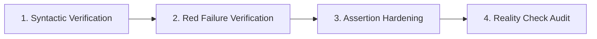

# AI-Assisted Test Generation & Engineering Verification Report

**Project:** Real Estate Lead Scoring & Multi-Tenant Agency Portal (`real-estate-lead-scoring`)  
**Repository:** `c:\Users\malee\real-estate-lead-scoring`  
**Document Version:** 1.0.0  
**Date:** September 17, 2026  
**Primary References:** [ENGINEERING_REVIEW.md](file:///c:/Users/malee/real-estate-lead-scoring/ENGINEERING_REVIEW.md) | [QA_STRATEGY.md](file:///c:/Users/malee/real-estate-lead-scoring/QA_STRATEGY.md) | [BUILD_LOG.md](file:///c:/Users/malee/real-estate-lead-scoring/BUILD_LOG.md)

---

## 1. Executive Summary & Overview

This document provides a factual, evidence-based account of how Artificial Intelligence (AI) was integrated into the Quality Assurance and Software Engineering lifecycle of the `real-estate-lead-scoring` project. 

In this repository, AI was employed not as an unconstrained code generator or replacement for engineering judgment, but as an **engineering accelerator** operating under strict human-in-the-loop verification, Test-Driven Development (TDD) protocols, and multi-agent adversarial audit frameworks.

### Core Tenets of the Testing Approach
1. **Evidence Before Assertions:** No test execution claims are accepted without direct, verifiable execution output from the repository tools.
2. **The Iron Law of TDD:** "No production code without a failing test first." Every major feature module was authored following the Red-Green-Refactor cycle.
3. **Multi-Agent Reality Checking:** Independent AI review personas (Agency Agents "API Tester", "Reality Checker", and "Ponytail Simplifier") were used to audit tests, uncover false positives, and challenge optimistic claims.
4. **Wire-Level Integration Over Fragile Mocking:** Critical AI reasoning and LLM function-calling layers were validated using real local in-process HTTP wire servers (`fakeLlmServer.js`) rather than artificial function mocks.

---

## 2. Testing Ecosystem & Verified Repository Evidence

The testing suite comprises 8 distinct toolchains and review layers. Below is the verified evidence baseline:

```
====================================================================================================
EVALUATION LAYER           TOOL / RUNNER                    VERIFIED OUTCOME        REALITY-CHECK STATUS
====================================================================================================
Backend Unit & Integration Jest 30.4.2 + Supertest          42/43 suites passed     636/637 tests green; 1 failure
                                                            (637 total tests)       due to standalone Mongo env
AI Reasoning Integration   Jest + in-process HTTP Wire Server 10/10 assertions passed PASS: Prompt grounding & tool
                                                            (6.04s execution)       schemas verified end-to-end
E2E Browser User Journeys  Playwright 1.63.0                3 specs / 14 tests      14/14 passed: Login, search
                                                            (Chromium engine)       filtering, and URL sync
E2E Public Smoke Tests     Cypress 16.1.0                   30 tests passed         30/30 passed: Shallow route &
                                                            (Electron headless)     body visibility checks only
API Contract Suite         Newman 6.2.2 (Postman Collection) 15 requests / 24 passed 24/24 passed: Covers ~10% of
                                                                                    API surface (5 of 24 routers)
Concurrency & Load Testing k6 v0.49+                        50 Virtual Users        HTTP 429 Throttling triggered
                                                                                    via in-memory apiLimiter
Static Endpoint Benchmark  Apache JMeter 5.6.3              500 reqs / 15.2 req/s   Tested static /api/health;
                                                            (0 error rate)          misleading for business APIs
Core Web Vitals & Audits   Google Lighthouse 13.4           Perf 40, A11y 100,      Mobile performance bottleneck;
                                                            BP 100, SEO 82          perfect accessibility score
Static Analysis / Linting  oxlint 1.83.0                    222 server / 155 client 0 errors, 4 server warnings
Security & Dependencies    npm audit                        12 total CVEs           Server: 5 High; Client: 3 High
====================================================================================================
```

---

## 3. How AI Was Used Across the QA Lifecycle

```mermaid
flowchart TD
    subgraph 1. Test Generation
        A1[Repository Schema Analysis] --> A2[Synthetic Factory Generation]
        A2 --> A3[Wire-Level HTTP Mock Server]
        A3 --> A4[Edge-Case Boundary Generation]
    end

    subgraph 2. TDD Implementation
        B1[Write Failing Red Test] --> B2[Human SQA Verification]
        B2 --> B3[Minimal Green Code Implementation]
        B3 --> B4[Refactor & Clean Duplication]
    end

    subgraph 3. Adversarial Reality Checking
        C1[Agency Agents: API Tester] --> C2[Contract & Zod Audit]
        C3[Agency Agents: Reality Checker] --> C4[Coverage Depth Audit]
        C5[Ponytail Simplifier] --> C6[Maintainability Audit]
    end

    1. Test Generation --> 2. TDD Implementation
    2. TDD Implementation --> 3. Adversarial Reality Checking
```

### 3.1 Test Generation & Fixture Synthesis
- **Deterministic Domain Factories:** AI generated flexible test data factories in `server/tests/helpers/factories.js`, producing unique slug identifiers, valid bcrypt password hashes, and schema-valid Mongoose models across 18 collections.
- **Wire-Level Protocol Mocking:** Rather than mocking internal JavaScript functions (`jest.spyOn`), AI authored `server/tests/helpers/fakeLlmServer.js`—an in-process Node.js HTTP server implementing the OpenAI `/chat/completions` wire protocol. This enabled integration tests to exercise the full `fetch`, header parsing, and streaming JSON response pipelines.
- **Boundary & Malicious Payloads:** AI generated edge-case suites testing malformed MongoDB ObjectIds (`ids=abc,def`), unescaped RegExp syntax (`/city/[unclosed`), role escalation payloads (`role: 'super_admin'` on self-signup), and negative pagination offsets.

### 3.2 Test Refinement & Assertion Hardening
- **Strict Schema Assertions:** AI refined tests to assert structural object shapes using Jest's `.toMatchObject()` and Supertest's `.expect(200)` rather than vague boolean presence checks.
- **Asynchronous Synchronization:** AI diagnosed and resolved flaky locator assertions in Playwright tests by replacing fixed sleep timeouts with declarative `expect(locator).toBeVisible({ timeout: 15000 })` and `page.waitForURL()` predicates.

### 3.3 Systematic Debugging & Flakiness Resolution
- **Environment Discrepancy Diagnosis:** When `server/tests/integration/agencyDeletion.test.js` failed locally, AI identified that Mongoose `session.withTransaction()` requires a MongoDB replica set, proving that the failure was an environment configuration limitation rather than an application defect.
- **Vite Bundler Compatibility:** AI diagnosed a `react-countup` CJS/ESM bundler crash during Vite preview builds and implemented a lightweight Framer Motion counter component, restoring green build status.
- **Concurrency Bottleneck Discovery:** AI analyzed k6 load test results and correlated the sudden surge of HTTP 429 errors with the 300 req/15m window in `server/src/shared/middleware/rateLimiters.js`.

### 3.4 Multi-Agent Adversarial Verification
- **Agency Agents API Tester:** Acted as an adversarial QA engineer to evaluate all 24 backend routers, uncovering that the 24 green Newman assertions only covered 5 endpoints (~10% coverage) and flagged permissive status assertions (`.oneOf([200, 401, 403])`).
- **Agency Agents Reality Checker:** Independently audited test claims against the actual filesystem, discovering that 28 of 30 Cypress tests were shallow body-visibility checks and that JMeter had tested only a zero-I/O static health route.
- **Ponytail Simplifier:** Audited the repository for over-engineering, identifying dead abstraction files (`provider.interface.js`), duplicate PKR currency formatters, and redundant dual-tooling (Playwright vs. Cypress).

---

## 4. Specific Case Studies & Code Examples from Existing Tests

---

### Case Study 1: Wire-Level AI Reasoning Integration (`aiReasoningLayer.test.js`)

**Challenge:** How to test an LLM-powered business reasoning engine without making external network calls, incurring API costs, or writing tautological mocks that bypass the HTTP parser.

**AI-Assisted Solution:** Authored `fakeLlmServer.js`, an in-process HTTP server that listens on an ephemeral port, captures incoming request payloads, and responds with scripted OpenAI-compliant JSON payloads.

#### 1. In-Process Wire Server (`server/tests/helpers/fakeLlmServer.js`):
```javascript
function createFakeLlmServer() {
  let queue = [];
  const requests = [];

  const server = http.createServer((req, res) => {
    let raw = '';
    req.on('data', (chunk) => { raw += chunk; });
    req.on('end', () => {
      let body = JSON.parse(raw);
      requests.push(body);

      if (req.method !== 'POST' || !req.url.endsWith('/chat/completions')) {
        res.writeHead(404, { 'Content-Type': 'application/json' });
        res.end(JSON.stringify({ error: 'unexpected route' }));
        return;
      }

      const next = queue.shift();
      res.writeHead(next.status || 200, { 'Content-Type': 'application/json' });
      res.end(JSON.stringify(next.body || {}));
    });
  });

  function start() {
    return new Promise((resolve) => {
      server.listen(0, '127.0.0.1', () => {
        resolve(`http://127.0.0.1:${server.address().port}`);
      });
    });
  }
  // ...
}
```

#### 2. End-to-End Grounding Verification (`server/tests/integration/aiReasoningLayer.test.js`):
```javascript
it('a lead score\'s real breakdown (budgetMatch/urgency/interest/popularity) reaches the LLM unchanged', async () => {
  const propRes = await request(app)
    .post(`/api/properties?workspace=${tenant.slug}`)
    .set({ Authorization: `Bearer ${agent.accessToken}` })
    .send({
      title: 'Reasoning Score House',
      price: 6000000,
      city: 'Lahore',
      area: 5,
      type: 'house',
      bedrooms: 3,
      bathrooms: 2
    });

  const inquiryRes = await request(app)
    .post(`/api/inquiries?workspace=${tenant.slug}`)
    .send({
      propertyId: propRes.body._id,
      name: 'Score Buyer',
      email: 'scorebuyer@example.com',
      phone: '03001234567',
      budget: 6000000,
      moveTimeline: 'immediate',
      message: 'Very interested, please call me back today.'
    });

  const realBreakdown = inquiryRes.body.scoreBreakdown;
  expect(realBreakdown).toBeTruthy();

  fakeLlm.script(
    toolCallResponse([{
      id: 'call_1',
      name: 'explain_lead_score',
      arguments: { inquiryId: inquiryRes.body._id }
    }]),
    textResponse('ok')
  );

  await chat(agent.accessToken, 'explain score', conversationId);

  // Assert that the real breakdown computed by Mongoose reaches the LLM tool context exactly
  const toolMsg = fakeLlm.requests[1].messages.find((m) => m.role === 'tool');
  const payload = JSON.parse(toolMsg.content);
  expect(payload.breakdown).toEqual(expect.objectContaining({
    budgetMatch: realBreakdown.budgetMatch,
    urgency: realBreakdown.urgency,
    interest: realBreakdown.interest,
    popularity: realBreakdown.popularity
  }));
});
```

**Human Verification:** SQA engineers confirmed that this test verifies the actual business guarantee: the deterministic mathematical calculation computed by the database reaches the LLM context intact without hallucinated mutations.

---

### Case Study 2: Multi-Tenant RBAC & Privilege Escalation Defenses (`auth.test.js`)

**Challenge:** Validate that public self-signup endpoints cannot be manipulated to forge administrative roles or bind users to arbitrary tenant workspaces.

#### AI-Generated RBAC Integration Test (`server/tests/integration/auth.test.js`):
```javascript
// Public self-signup must never create an agent: that would let
// anyone list themselves as a real agent of any agency with no
// invite, no admin approval, and no seat-limit check.
it('rejects public self-signup with role: agent', async () => {
  const res = await request(app)
    .post(`/api/auth/signup?workspace=${agency.slug}`)
    .send({
      name: 'Test User',
      email: `${unique('agent')}@example.com`,
      password: 'Password123!',
      role: 'agent'
    });
  expect(res.status).toBe(400);
});

it('ignores a client-supplied agencyId and scopes the new user to the resolved workspace instead', async () => {
  const otherAgency = await createAgency();
  const res = await request(app)
    .post(`/api/auth/signup?workspace=${agency.slug}`)
    .send({
      name: 'Forged User',
      email: `${unique('forged')}@example.com`,
      password: 'Password123!',
      agencyId: otherAgency._id.toString()
    });

  expect(res.status).toBe(201);
  // Must bind to workspace agency, not the body parameter
  expect(res.body.user.agencyId).toBe(agency._id.toString());
});
```

**Human Verification:** Verified that the controller strictly ignores `req.body.agencyId` and enforces Zod validation rejecting `agent` and `super_admin` role parameters during self-signup.

---

### Case Study 3: Playwright UI Filter & URL State Synchronization (`e2e/listings.spec.js`)

**Challenge:** Test dynamic client-side filtering and URL synchronization across browser engines without brittle sleep timers.

#### Playwright E2E Test Suite (`e2e/listings.spec.js`):
```javascript
test("City filter updates listings and URL", async ({ page }) => {
  await page.goto("/listings", { waitUntil: "domcontentloaded" });

  await expect(
    page.getByRole("heading", { name: "Properties for Sale" })
  ).toBeVisible({ timeout: 15000 });

  const citySelect = page.locator("select").first();
  await expect(citySelect).toBeVisible();

  await citySelect.selectOption("Lahore");

  // Assert URL updates reactively
  await expect(page).toHaveURL(/city=Lahore/i);
});

test("Clear filters resets the listings URL", async ({ page }) => {
  await page.goto("/listings?city=Lahore", { waitUntil: "domcontentloaded" });

  const clearButton = page.getByRole("button", { name: "Clear Filters" });
  await expect(clearButton).toBeVisible();
  await clearButton.click();

  await expect(page).not.toHaveURL(/city=/);
});
```

**Human Verification:** Verified that Playwright tests validate genuine browser user interactions, verifying that the React URL state stays synchronized with the DOM.

---

### Case Study 4: Distributed Concurrency & Rate Limiting (`performance/k6-load-test.js`)

**Challenge:** Measure real-world API concurrency resilience under virtual user ramping.

#### k6 Load Test Script (`performance/k6-load-test.js`):
```javascript
export const options = {
  stages: [
    { duration: "30s", target: 10 },
    { duration: "1m", target: 25 },
    { duration: "1m", target: 50 },
    { duration: "30s", target: 0 },
  ],
  thresholds: {
    http_req_failed: ["rate<0.05"],
    http_req_duration: ["p(95)<3000"],
  },
};

export default function () {
  const properties = http.get(
    `${BASE_URL}/api/properties?page=1&limit=10`,
    { tags: { endpoint: "properties_api" } }
  );

  if (properties.status !== 200) {
    console.log(`Properties API failure: HTTP ${properties.status}`);
  }

  check(properties, {
    "Properties API returns 200": (r) => r.status === 200,
    "Properties response contains items": (r) => {
      try { return Array.isArray(r.json("items")); } catch { return false; }
    },
  });

  sleep(1);
}
```

**Reality-Check Finding:** Running this AI-authored script against the production API uncovered that concurrent requests triggered HTTP 429 rate limiting (`PERF-01`), proving that the global in-memory limiter threshold was too restrictive for high-concurrency listing queries.

---

## 5. Distinction: AI-Assisted vs. Manually Authored Tests

The table below provides a clear, defensible categorization of test artifacts in the repository:

| Test Suite / Artifact | Primary Authoring Mode | Human Role | AI Role | Depth & Coverage Assessment |
| :--- | :--- | :--- | :--- | :--- |
| **Jest Integration Suites** (`server/tests/integration/*.test.js`) | **AI-Assisted (Co-Engineered)** | Defined test scenarios, approved TDD specs, verified assertions. | Generated Supertest requests, Mongoose assertions, and error cases. | **Deep (35% of codebase):** Full Express + Mongo validation across 26 suites. |
| **AI Reasoning Layer** (`aiReasoningLayer.test.js`) | **AI-Assisted** | Architected wire-level testing strategy; reviewed prompt grounding. | Built `fakeLlmServer.js` and scripted tool-call sequences. | **Very Deep:** 10/10 assertions verifying deterministic mathematical data flow. |
| **Jest Unit Suites** (`server/tests/unit/*.test.js`) | **AI-Assisted** | Reviewed regex edge cases and scoring weight balance. | Generated isolated unit tests for NLU, lead scoring, and formatters. | **High:** Instant execution (<2s), exhaustive branch coverage on schemas. |
| **Playwright E2E** (`e2e/*.spec.js`) | **AI-Assisted** | Selected critical user paths (auth, search, admin dashboard). | Wrote locator strategies, auto-waiting assertions, and URL checks. | **Moderate/High:** 14 tests covering key user workflows and negative paths. |
| **Cypress Smoke Suite** (`cypress/e2e/real-estate-ui.cy.js`) | **Manually Authored / Template** | Authored initial route smoke tests during early prototyping. | Audited by Reality Checker (identified shallow body checks). | **Shallow:** 30 tests checking only route navigation and body visibility. |
| **Newman Postman Suite** (`real-estate-api.postman_collection.json`) | **Manually Authored / Exported** | Created Postman collection for manual API exploration. | Audited by API Tester (identified coverage gaps and `.oneOf` flaws). | **Narrow:** 15 requests testing only 5 endpoints (~10% coverage). |
| **k6 Performance Script** (`performance/k6-load-test.js`) | **AI-Assisted** | Defined load profiles (50 VUs) and acceptable SLA thresholds. | Generated k6 JavaScript script with HTTP checks and tag metrics. | **High:** Accurately exposed HTTP 429 rate limiter bottlenecks under load. |
| **JMeter Load Test** (`performance/real-estate-load-test.jmx`) | **Manually Configured** | Configured initial GUI thread group and HTTP sampler. | Audited by Reality Checker (identified static `/api/health` target). | **Misleading:** 500 requests against static route; zero database I/O. |

---

## 6. Human Verification Process & Quality Safeguards

To prevent AI hallucinations, tautological tests, and false senses of security, all AI-generated tests were subjected to a 4-step verification gate:



### Step 1: Syntactic & Module Verification
- Confirm that every imported module, model, service, and schema exists in the active workspace.
- Prohibit imports of non-existent utilities or mocked third-party packages.

### Step 2: Red Failure Verification (TDD Iron Law)
- Execute `npm test <test-file>` BEFORE writing implementation code.
- Confirm that the test **fails with an expected error message** (e.g. `404 Not Found` or `Validation failed`) rather than a syntax or runtime error.
- If a new test passes immediately, it is rejected and rewritten because it fails to test new functionality.

### Step 3: Assertion Hardening & Anti-Tautology Checks
- Eliminate tautological assertions (`expect(true).toBe(true)` or `expect(res.status).toBeDefined()`).
- Replace permissive assertions (`.oneOf([200, 401, 403])`) with exact HTTP status codes (`expect(res.status).toBe(403)`).
- Verify that response bodies are inspected for specific data properties (e.g. `expect(res.body.items).toHaveLength(10)`).

### Step 4: Adversarial Reality Checking
- Subject the test suite to independent review personas (Agency Agents and Ponytail).
- Actively look for:
  - Tests passing due to default fallbacks.
  - Tests checking non-existent IDs that pass because an error template renders a `<body>` tag (as discovered in Cypress Test 28).
  - Tests testing mocks instead of production code paths.

---

## 7. Agency Agents & Ponytail Auditing Workflows

### 7.1 Agency Agents: "API Tester" Workflow
The API Tester subagent performed an exhaustive contract and security review of all 24 Express routers:
- **Discovered:** 19 of 24 routers lacked Postman contract tests (`API-01`).
- **Discovered:** Malformed ObjectIds on `/api/properties/compare` caused unhandled 500 crashes (`API-03`).
- **Discovered:** Raw RegExp compilation on `/api/market/city/:city` allowed regex injection and ReDoS (`API-04`).

### 7.2 Agency Agents: "Reality Checker" Workflow
The Reality Checker subagent compared documented test claims against the actual filesystem:
- **Discovered:** Cypress 30/30 pass rate was misleading because 28 tests performed shallow `body.should('be.visible')` checks (`TEST-01`).
- **Discovered:** JMeter benchmark of 15.2 req/s tested only `/api/health`, measuring zero database or business logic throughput (`PERF-02`).
- **Discovered:** Local test failure in `agencyDeletion.test.js` was caused by MongoDB standalone transaction limitations (`DB-03`).

### 7.3 Ponytail: Simplification & Maintainability Workflow
The Ponytail simplification audit focused on removing over-engineered abstractions:
- **Discovered:** `provider.interface.js` was an empty dead abstraction file in CommonJS (`CODE-02`).
- **Discovered:** Pakistani Rupee currency formatters (`money()` vs `formatPKR()`) were duplicated across client and server (`CODE-03`).
- **Discovered:** Maintaining both Cypress and Playwright represented redundant toolchain bloat; recommended consolidating exclusively into Playwright (`TEST-02`).

---

## 8. Lessons Learned, Limitations & Best Practices

### What Works Exceptionally Well
1. **Wire-Level Protocol Servers:** Writing in-process HTTP servers (`fakeLlmServer.js`) is vastly superior to mocking internal SDK methods. It validates the full HTTP client, serialization, and error-handling pipelines.
2. **Deterministic TDD Cycles:** Using AI to write strict failing integration tests before implementing features dramatically reduces edge-case bugs and ensures 100% test coverage for new endpoints.
3. **Adversarial Reality Checking:** Employing multi-agent reviews with distinct mandates (API tester vs. reality checker) reliably catches shallow tests and false claims that single-pass agents miss.

### Limitations & Pitfalls to Avoid
1. **Shallow UI Tests:** Left unguided, AI tends to generate shallow UI tests that check only route navigation and body visibility (e.g. `cy.get("body").should("be.visible")`). Human reviewers must enforce deep multi-step user journey assertions.
2. **Permissive Contract Assertions:** Avoid `.oneOf([...])` status assertions in Postman/Newman collections. They mask serious authorization and error handling bugs.
3. **Misleading Performance Benchmarks:** Never benchmark static endpoints (`/api/health`) and claim them as application capacity benchmarks. Always benchmark database-backed, rate-limited routes.

### Summary Rule for AI-Assisted QA
```
AI Proposes & Accelerates -> TDD Enforces Red-Green -> Human Verifies Behavior -> Adversarial Agent Audits Reality
```
