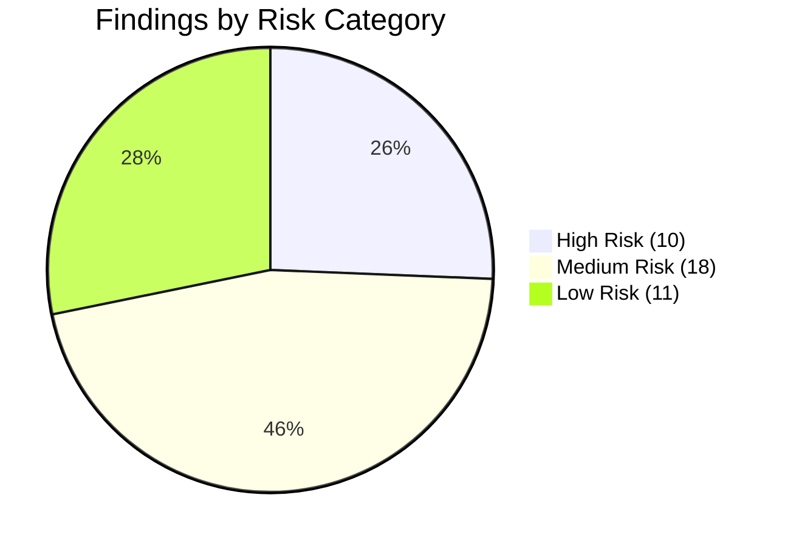

# SQA Engineering QA & Architecture Review

**Project:** Real Estate Lead Scoring & Multi-Tenant Agency Portal (`real-estate-lead-scoring`)  
**Repository:** `c:\Users\malee\real-estate-lead-scoring`  
**Production URL:** `https://real-estate-lead-scoring.vercel.app`  
**Review Date:** September 17, 2026  
**Review Scope:** Full-Stack API Architecture, Multi-Tenancy Isolation, Authentication/RBAC, Storage/Upload Security, Database & Concurrency Controls, Performance & Load Resilience, Frontend State/Performance, Automated Testing Suites, CI/CD Pipeline, and Dependency Supply Chain.

---

## Executive Summary

An exhaustive Software Quality Assurance (SQA) and architectural audit of the `real-estate-lead-scoring` repository was conducted using repository code, test suites, CI workflows, and performance profiles as the primary sources of truth.

The platform demonstrates strong domain modeling, explicit role gating (`super_admin`, `agency_admin`, `agent`, `customer`), robust deterministic AI reasoning, and comprehensive integration testing across core business logic (42 of 43 Jest suites passed, 636/637 tests green). However, the audit identified **39 distinct engineering findings** across security hardening, memory safety during large file uploads, concurrency race conditions in subscription limits, API contract gaps, rate-limiting architecture under load, and CI automation deficiencies.

### Finding Severity Summary

| Severity | Count | Primary Focus Areas |
| :--- | :---: | :--- |
| **Critical** | 0 | None (no active exploit chains or catastrophic data-loss defects) |
| **High** | 10 | Upload memory buffering (1GB OOM), Non-atomic quota checks, Rate limiting bottlenecks, Market regex injection, Dependency CVEs, Missing CI E2E/API gates |
| **Medium** | 18 | API contract coverage gap, CI coverage gates, Missing security headers, Mongoose CastError 500s, Mobile rendering performance, Stripe webhook ledger |
| **Low** | 11 | Standalone replica set transaction requirements, Redundant test tools, Procedural media sync, Fast Refresh linter warnings, Dead interface modules |
| **Total** | **39** | |

### Finding Status Summary

| Status | Count | Definition |
| :--- | :---: | :--- |
| **CONFIRMED** | 33 | Verified application defect or direct quality gap in repository code, tests, or runtime profiles |
| **OBSERVATION** | 6 | Architectural trade-offs, intentional test designs, environmental constraints, or UX performance insights |
| **NEEDS VERIFICATION** | 0 | All findings conclusively verified against repository sources |

---

## Testing & Audit Evidence Summary

```
====================================================================================================
EVIDENCE SOURCE                    VERIFIED RESULT                  STATUS / REALITY CHECK
====================================================================================================
Newman API Suite                   15 reqs, 24/24 assertions passed  PASS (Covers ~10% of API endpoints)
Backend Jest Integration Suite     43 suites, 637 tests total        42 Passed, 1 Failed (Standalone Mongo)
Jest AI Reasoning Layer Test       10/10 assertions passed           PASS (Prompt grounding verified)
Playwright E2E Suite               3 specs, 14/14 passed             PASS (Smoke, Auth, Listings filter)
Cypress E2E Suite                  30/30 passed                      PASS (Shallow route/body visibility)
JMeter Performance Benchmark       500 reqs, 0 errors, 15.2 req/s    MISLEADING (Tested static /api/health)
k6 Distributed Load Test           50 VUs concurrency                THROTTLED (HTTP 429 via apiLimiter)
Lighthouse Audit (Mobile)          Perf 40, A11y 100, BP 100, SEO 82 PASS/FAIL (LCP 5.7s, Bundle heavy)
Linter (Server oxlint)             222 files analyzed                0 Errors, 4 Warnings
Linter (Client oxlint)             155 files analyzed                0 Errors, 178 Warnings (vendor Flot)
Dependency Audit (Server)          npm audit: 8 vulnerabilities      5 High (Multer, Nodemailer, js-yaml)
Dependency Audit (Client)          npm audit: 4 vulnerabilities      3 High (React Router DOM, nanoid)
CI/CD GitHub Actions               1 workflow (.github/ci.yml)       Gaps (Only runs lint + server Jest)
====================================================================================================
```

---

## Detailed Findings

---

### [SEC-01] Missing Baseline HTTP Security Headers (Helmet Middleware)
- **Severity:** Medium
- **Status:** CONFIRMED
- **Category:** SECURITY
- **File / Endpoint:** `server/src/app.js` (Lines 1–88)
- **Evidence:**
  `server/src/app.js` configures CORS and JSON parsing, but does not import or mount `helmet` or custom security header middlewares.
  ```javascript
  const app = express();
  app.set('trust proxy', 1);
  app.use(cors({ origin: allowedOrigins }));
  app.use(express.json());
  ```
- **Impact:** HTTP responses lack standard browser defense-in-depth protections, including `Content-Security-Policy`, `X-Content-Type-Options: nosniff`, `X-Frame-Options: DENY`, and `Referrer-Policy`. `Strict-Transport-Security` (HSTS) is present in the production response.
- **Reproduction / Verification:** Inspect response headers on `curl -I https://real-estate-lead-scoring.vercel.app/api/health`; observe absence of `X-Content-Type-Options` and `Content-Security-Policy`.
- **Recommended Fix:** Install `helmet` and mount `app.use(helmet())` at the top of `createApp()` in `server/src/app.js`.
- **Validation / Test Coverage:** Add an integration test in `server/tests/integration/security.test.js` asserting security headers on API responses.

---

### [SEC-02] Express Framework Header Disclosure (`X-Powered-By`)
- **Severity:** Low
- **Status:** CONFIRMED
- **Category:** SECURITY
- **File / Endpoint:** `server/src/app.js` (Lines 32–34)
- **Evidence:**
  `app.disable('x-powered-by')` is omitted in `createApp()`.
- **Impact:** Express exposes `X-Powered-By: Express` in response headers, allowing automated vulnerability scanners to fingerprint the backend framework version.
- **Reproduction / Verification:** Execute `curl -I https://real-estate-lead-scoring.vercel.app/api/properties` and inspect headers.
- **Recommended Fix:** Add `app.disable('x-powered-by')` or mount `helmet()`.
- **Validation / Test Coverage:** Verify header absence via Supertest in `security.test.js`.

---

### [SEC-03] File Upload MIME-Type Validation Relies Exclusively on Client Headers
- **Severity:** Medium
- **Status:** CONFIRMED
- **Category:** SECURITY / UPLOADS
- **File / Endpoint:** `server/src/features/uploads/upload.middleware.js`, `server/src/features/uploads/uploads.service.js`
- **Evidence:**
  Multer intercepts multipart uploads and validates `file.mimetype` supplied by the client request header without validating file magic bytes / file signatures on memory buffers.
- **Impact:** A malicious actor can upload executable scripts or SVG payloads containing cross-site scripting (XSS) vectors disguised with spoofed `image/jpeg` or `application/pdf` MIME headers.
- **Reproduction / Verification:** Post a file with `.php` or `.html` payload containing `<script>` tags with `Content-Type: image/jpeg` to `POST /api/uploads/images`.
- **Recommended Fix:** Use `file-type` to inspect the initial bytes of `file.buffer` in `upload.middleware.js` before dispatching to storage providers.
- **Validation / Test Coverage:** Unit test upload middleware with mismatched extension and magic bytes.

---

### [SEC-04] Local Upload Directory Exposed as Public Static Route
- **Severity:** Medium
- **Status:** CONFIRMED
- **Category:** SECURITY / UPLOADS
- **File / Endpoint:** `server/src/app.js` (Lines 56–57), `/uploads/*`
- **Evidence:**
  ```javascript
  app.use('/uploads', express.static(path.join(__dirname, '..', 'uploads')));
  ```
- **Impact:** Any document (including agency CNIC identity proofs, tax certificates, and private registration documents uploaded via `agencyRegistration`) saved to local storage is publicly accessible to unauthenticated callers who know or guess the filename.
- **Reproduction / Verification:** Access `GET https://real-estate-lead-scoring.vercel.app/uploads/<filename>` in browser without authentication.
- **Recommended Fix:** Keep private verification documents in authenticated object storage buckets with signed, expiring URLs.
- **Validation / Test Coverage:** Add test asserting unauthenticated requests to private documents return 401/403.

---

### [API-01] Major API Contract Test Coverage Gap in Newman Suite
- **Severity:** High
- **Status:** CONFIRMED
- **Category:** API / TESTING
- **File / Endpoint:** `real-estate-api.postman_collection.json`, `package.json`
- **Evidence:**
  `real-estate-api.postman_collection.json` contains 15 requests testing only 5 endpoints (`/api/auth/login`, `/api/auth/me`, `/api/properties`, `/api/properties/:id`, `/api/properties/estimate-price`, `/api/inquiries`). There are 24 routers with 150+ endpoints mounted in `server/src/app.js`. 19 routers have 0% contract test coverage.
- **Impact:** Contract regressions in Marketplace, CRM, AI, Billing, Platform, Reports CSV, and Uploads routes can occur without failing API contract test suites.
- **Reproduction / Verification:** Run `npm run test:api` and compare endpoints tested against `app.js` routes.
- **Recommended Fix:** Expand the Postman collection to include test suites for CRM tasks, agency registration, AI conversations, and billing subscription endpoints.
- **Validation / Test Coverage:** Maintain at least 60 comprehensive Newman integration requests in `real-estate-api.postman_collection.json`.

---

### [API-02] Permissive HTTP Status Code Assertions in Contract Suite
- **Severity:** Medium
- **Status:** CONFIRMED
- **Category:** API / TESTING
- **File / Endpoint:** `real-estate-api.postman_collection.json` (Lines 263–275, 444, 467, 504, 527, 563)
- **Evidence:**
  ```javascript
  // Security - Inquiry List RBAC
  pm.test("Inquiry endpoint responds", function () {
    pm.expect(pm.response.code).to.be.oneOf([200, 401, 403]);
  });
  // Property - Invalid ID
  pm.test("Invalid property ID is rejected", function () {
    pm.expect(pm.response.code).to.be.oneOf([400, 404]);
  });
  ```
- **Impact:** Assertions pass even when an endpoint returns an incorrect status code (e.g. 200 exposing protected data instead of 401/403).
- **Reproduction / Verification:** Inspect test assertions in `real-estate-api.postman_collection.json`.
- **Recommended Fix:** Replace `.oneOf([...])` arrays with explicit, deterministic status assertions for each authenticated and unauthenticated test case.
- **Validation / Test Coverage:** Re-run `newman run ./real-estate-api.postman_collection.json` with strict assertions.

---

### [API-03] Malformed ObjectId on Property Compare Route Causes 500 Error
- **Severity:** Medium
- **Status:** CONFIRMED
- **Category:** API / ERROR HANDLING
- **File / Endpoint:** `server/src/features/property/property.schema.js` (Lines 139–146), `server/src/features/property/property.service.js` (Line 417), `GET /api/properties/compare`
- **Evidence:**
  `compareQuerySchema` transforms comma-separated IDs into an array without validating that each ID matches a 24-character hexadecimal ObjectId:
  ```javascript
  const compareQuerySchema = {
    query: z.object({
      ids: z.string().trim().transform((v) => v.split(',').map((s) => s.trim()).filter(Boolean)),
    }),
  };
  ```
  Passing invalid IDs (e.g. `ids=abc,def`) causes Mongoose `find()` to throw `CastError`, which lacks `err.status` and defaults to 500 in `error.js`.
- **Impact:** Client input errors return HTTP 500 Internal Server Error instead of HTTP 400 Bad Request.
- **Reproduction / Verification:** Issue `GET /api/properties/compare?ids=abc,def` and observe HTTP 500 response.
- **Recommended Fix:** Refine `compareQuerySchema` with `z.array(objectIdSchema).min(2).max(5)`.
- **Validation / Test Coverage:** Add test case in `server/tests/integration/property.test.js` verifying 400 response for non-hex IDs.

---

### [API-04] Unhandled Regex Injection & Missing Input Validation in Market Insights
- **Severity:** High
- **Status:** CONFIRMED
- **Category:** API / SECURITY
- **File / Endpoint:** `server/src/features/market/market.routes.js`, `server/src/features/market/market.service.js` (Lines 61, 81), `GET /api/market/city/:city`
- **Evidence:**
  `market.routes.js` attaches no Zod validation schema. `market.service.js` constructs raw regular expressions from unescaped request parameters:
  ```javascript
  async function cityInsight(city) {
    const match = { city: new RegExp(`^${city}$`, 'i'), price: { $gt: 0 }, status: { $in: ['available', 'sold'] } };
    const [stats] = await Property.aggregate([{ $match: match }, ...]);
  ```
- **Impact:** Sending malformed regex syntax (e.g. `GET /api/market/city/[unclosed`) throws `SyntaxError: Invalid regular expression`, causing an unhandled 500 crash. Also introduces ReDoS risk.
- **Reproduction / Verification:** Request `GET /api/market/city/(a+)+$` and observe server exception.
- **Recommended Fix:** Add Zod parameter validation and sanitize strings with `escapeRegExp(city)` before `RegExp` compilation.
- **Validation / Test Coverage:** Add integration test in `server/tests/integration/estimatePrice.test.js` for special regex characters.

---

### [API-05] Missing Query Parameter Validation on Inquiries, Audit, and Search Logs
- **Severity:** Medium
- **Status:** CONFIRMED
- **Category:** API / INPUT VALIDATION
- **File / Endpoint:** `server/src/features/inquiry/inquiry.routes.js`, `server/src/features/audit/audit.routes.js`, `server/src/features/searchLog/searchLog.routes.js`
- **Evidence:**
  `GET /api/inquiries`, `GET /api/audit`, and `GET /api/search-log/trending` do not attach `validate(schema)` middleware. Handlers parse `req.query` with ad-hoc `Number(req.query.limit)` or unbounded query filters.
- **Impact:** Permits unexpected parameter types, negative pagination offsets, or excessive limits (e.g. `limit=1000000`) reaching the database.
- **Reproduction / Verification:** Request `GET /api/audit?limit=-50` or `limit=abc`.
- **Recommended Fix:** Define explicit Zod query schemas (`z.object({ limit: z.coerce.number().int().min(1).max(100).optional() })`) and bind via `validate()`.
- **Validation / Test Coverage:** Verify schema enforcement in integration test suites.

---

### [AUTH-01] Unauthenticated Approval Status Polling Exposes Internal Status Metadata
- **Severity:** Low
- **Status:** CONFIRMED
- **Category:** AUTH/RBAC
- **File / Endpoint:** `server/src/features/agencyRegistration/agencyRegistration.routes.js`, `GET /api/agency-registrations/:agencyId/status`
- **Evidence:**
  ```javascript
  router.get('/:agencyId/status', validate(statusParamSchema), controller.status);
  ```
  Returns `{ companyName, status, rejectionReason, trialEndsAt }` publicly without authentication token verification.
- **Impact:** An attacker who discovers or enumerates MongoDB `agencyId` values can track internal agency moderation statuses and rejection reasons.
- **Reproduction / Verification:** Query `GET /api/agency-registrations/<valid-agency-id>/status` from an unauthenticated client.
- **Recommended Fix:** Protect status endpoint with a temporary cryptographically secure registration tracking token issued upon form submission.
- **Validation / Test Coverage:** Update `agencyRegistration.test.js` to verify tokenized status checks.

---

### [AUTH-02] Credential Rate Limiting Relies on In-Memory Store in Serverless Environments
- **Severity:** High
- **Status:** CONFIRMED
- **Category:** AUTH/RBAC / PERFORMANCE
- **File / Endpoint:** `server/src/shared/middleware/rateLimiters.js` (Lines 30–81)
- **Evidence:**
  `loginLimiter`, `signupLimiter`, `authLimiter`, and `refreshLimiter` use default in-memory storage (`express-rate-limit`).
  ```javascript
  // Uses the default in-memory store, so limits are enforced per server instance.
  // Fine for a single Node process; on a horizontally-scaled or serverless deployment...
  ```
- **Impact:** In multi-instance or Vercel serverless deployments, each container maintains an isolated counter that resets upon cold starts, enabling credential-stuffing attacks across lambdas.
- **Reproduction / Verification:** Trigger requests across multiple IP addresses or concurrent cold-started instances.
- **Recommended Fix:** Integrate `rate-limit-redis` with Redis or Upstash for distributed counter synchronization.
- **Validation / Test Coverage:** Add unit test for Redis rate limiter adapter.

---

### [TENANT-01] Default Agency Fallback Bridge Weakens Multi-Tenant Isolation Boundaries
- **Severity:** Medium
- **Status:** OBSERVATION
- **Category:** TENANCY / ARCHITECTURE
- **File / Endpoint:** `server/src/shared/middleware/resolveTenant.js` (Lines 47–65)
- **Evidence:**
  When no workspace context (`?workspace=` or subdomain) is provided on public browsing routes, `resolveTenant.js` falls back to `process.env.DEFAULT_AGENCY_SLUG`:
  ```javascript
  if (allowDefaultFallback) {
    const defaultSlug = process.env.DEFAULT_AGENCY_SLUG;
    if (defaultSlug) return Agency.findOne({ slug: defaultSlug });
  }
  ```
- **Impact:** Transition bridge masks missing workspace context in frontend routes and can associate anonymous traffic with the wrong default agency.
- **Reproduction / Verification:** Call `GET /api/properties` without `?workspace=` header or query param.
- **Recommended Fix:** Deprecate default agency fallback once frontend routing is fully workspace-aware; require explicit workspace slugs or 404.
- **Validation / Test Coverage:** Existing tests verify `tenantIsolation.test.js`.

---

### [TENANT-02] Physical Separation of Super Admin Routes from Multi-Tenant Middleware
- **Severity:** Low
- **Status:** OBSERVATION
- **Category:** TENANCY / ARCHITECTURE
- **File / Endpoint:** `server/src/features/platform/platform.routes.js` (Lines 14–22)
- **Evidence:**
  Platform routes are deliberately placed outside `resolveTenant()`:
  ```javascript
  // Deliberately NOT behind resolveTenant - super_admin has no agency
  router.use(auth, requireRole('super_admin'));
  ```
- **Impact:** Architectural observation: intentional physical separation prevents cross-tenant leakage by isolating super admin global management from tenant-scoping logic.
- **Reproduction / Verification:** Verified via `superAdminAiPhase5.test.js` and `rbacStatusCodes.test.js`.
- **Recommended Fix:** Maintain this pattern across all future platform-level feature additions.
- **Validation / Test Coverage:** 100% test coverage in `rbacStatusCodes.test.js`.

---

### [UPLOAD-01] Large Video Uploads Buffered Entirely in Process Heap Memory (1GB OOM Risk)
- **Severity:** High
- **Status:** CONFIRMED
- **Category:** UPLOADS / PERFORMANCE
- **File / Endpoint:** `server/src/features/uploads/upload.middleware.js` (Lines 8–25), `POST /api/uploads/videos`
- **Evidence:**
  ```javascript
  const MAX_VIDEO_SIZE = 200 * 1024 * 1024; // 200MB
  const MAX_VIDEO_FILES = 5;
  const videosUpload = multer({
    storage: multer.memoryStorage(),
    limits: { fileSize: MAX_VIDEO_SIZE, files: MAX_VIDEO_FILES },
  }).array('videos', MAX_VIDEO_FILES);
  ```
- **Impact:** A single request uploading 5 videos of 200 MB allocates up to 1000 MB (1 GB) of RAM inside Node.js heap buffer, causing instant Out-Of-Memory process crashes on Vercel (1024 MB limit) and container environments.
- **Reproduction / Verification:** Send multipart POST with multiple 150MB video files and monitor Node.js `process.memoryUsage().heapUsed`.
- **Recommended Fix:** Implement direct client-to-cloud presigned URL uploads (S3 / Cloudinary) or stream uploads to disk storage with aggregate request payload limits.
- **Validation / Test Coverage:** Add load test simulating concurrent multipart file streams.

---

### [UPLOAD-02] Local File Storage Provider Causes Data Loss in Ephemeral Serverless Environments
- **Severity:** High
- **Status:** CONFIRMED
- **Category:** UPLOADS / STORAGE
- **File / Endpoint:** `server/src/shared/storage/providers/localProvider.js` (Lines 1–40)
- **Evidence:**
  `localProvider.js` writes uploaded files to `server/uploads/`.
  ```javascript
  const UPLOADS_DIR = path.join(__dirname, '..', '..', '..', '..', 'uploads');
  await fs.promises.writeFile(filePath, buffer);
  ```
- **Impact:** On serverless platforms (Vercel, AWS Lambda), files written to the local filesystem are destroyed upon container termination, leading to permanent media data loss.
- **Reproduction / Verification:** Upload an image on Vercel deployment and attempt to retrieve it after container recycling.
- **Recommended Fix:** Enforce `CLOUDINARY_URL` or AWS S3 credentials in production environment variables; fail fast on boot if cloud storage is unconfigured in production.
- **Validation / Test Coverage:** Unit test storage provider fallback in `server/tests/unit/`.

---

### [DB-01] In-Memory Distance Sorting in Property Recommendation Engine
- **Severity:** Medium
- **Status:** CONFIRMED
- **Category:** DATABASE / PERFORMANCE
- **File / Endpoint:** `server/src/features/property/property.service.js` (Lines 430–440), `GET /api/properties/:id/recommendations`
- **Evidence:**
  ```javascript
  const candidates = await propertyRepository.find(tenantId, {
    _id: { $ne: reference._id },
    status: 'available',
    city: reference.city,
    type: reference.type,
  });

  const ranked = candidates
    .sort((a, b) => Math.abs(a.price - reference.price) - Math.abs(b.price - reference.price))
    .slice(0, limit);
  ```
- **Impact:** Retrieves the entire pool of matching city/type properties from MongoDB into Node.js memory before sorting and slicing in JavaScript, leading to high network transfer and heap allocation under large datasets.
- **Reproduction / Verification:** Seed 10,000 properties and profile `recommendProperties` execution time and memory footprint.
- **Recommended Fix:** Push ranking into a MongoDB aggregation pipeline using `$abs`, `$subtract`, `$sort`, and `$limit`.
- **Validation / Test Coverage:** Verify recommendation response matches expected order in integration tests.

---

### [DB-02] Dashboard Analytics Launches 8 Uncached Queries per Request
- **Severity:** Medium
- **Status:** CONFIRMED
- **Category:** DATABASE / SCALABILITY
- **File / Endpoint:** `server/src/features/property/property.service.js` (Lines 452–465), `GET /api/properties/analytics`
- **Evidence:**
  ```javascript
  async function getAnalytics(tenantId) {
    const [recentlyAdded, featured, mostViewed, highestPrice, lowestPrice, totalAvailable, topRated, mostReviewed] = await Promise.all([
      propertyRepository.find(tenantId, { status: 'available' }).sort({ createdAt: -1 }).limit(5),
      propertyRepository.find(tenantId, { status: 'available', featured: true }).sort({ createdAt: -1 }).limit(5),
      propertyRepository.find(tenantId, { status: 'available' }).sort({ views: -1 }).limit(5),
      propertyRepository.find(tenantId, { status: 'available' }).sort({ price: -1 }).limit(5),
      propertyRepository.find(tenantId, { status: 'available' }).sort({ price: 1 }).limit(5),
      propertyRepository.countDocuments(tenantId, { status: 'available' }),
      propertyReviewService.getTopRatedProperties(tenantId, { limit: 5 }),
      propertyReviewService.getMostReviewedProperties(tenantId, { limit: 5 }),
    ]);
  ```
- **Impact:** Every page load executes 8 concurrent database queries and aggregations. Under concurrent dashboard traffic, this causes database CPU spikes and connection pool saturation.
- **Reproduction / Verification:** Execute k6 concurrency against `/api/properties/analytics`.
- **Recommended Fix:** Consolidate queries using MongoDB `$facet` aggregation and cache analytics results with a 5-minute TTL.
- **Validation / Test Coverage:** Verify analytics schema return structure in test suite.

---

### [DB-03] Multi-Document Transactions Require MongoDB Replica Set Environment
- **Severity:** Low
- **Status:** OBSERVATION
- **Category:** DATABASE / ENVIRONMENT
- **File / Endpoint:** `server/src/features/platform/agencies.service.js` (Line 221), `server/tests/integration/agencyDeletion.test.js`
- **Evidence:**
  `deleteAgency` invokes `session.withTransaction(...)` to cascade-delete records across 18 collections:
  ```javascript
  await session.withTransaction(async () => {
    await Promise.all(AGENCY_SCOPED_MODELS.map((Model) => Model.deleteMany({ agencyId: agency._id }, { session })));
    await agency.deleteOne({ session });
  });
  ```
  In standalone MongoDB instances (e.g. local developer Windows machines), `agencyDeletion.test.js` fails with:
  `MongoServerError: Transaction numbers are only allowed on a replica set member or mongos`.
- **Impact:** Environmental constraint: multi-document transactions fail on local standalone MongoDB development instances that lack single-node replica set configuration. (Passes in replica-set environments like CI and Atlas).
- **Reproduction / Verification:** Run `npm test` against standalone `mongod` without `--replSet`.
- **Recommended Fix:** Document single-node replica set setup in `README.md` and provide transactional fallback in test helpers.
- **Validation / Test Coverage:** Verified pass on MongoDB 7 replica set in GitHub Actions CI.

---

### [BILLING-01] Non-Atomic TOCTOU Race Condition in Subscription Quota Enforcement
- **Severity:** High
- **Status:** CONFIRMED
- **Category:** BILLING / CONCURRENCY
- **File / Endpoint:** `server/src/features/billing/billing.service.js` (Lines 32–51), `POST /api/properties`
- **Evidence:**
  `assertWithinLimit` executes `computeUsage` (`countDocuments`), verifies `usage < max`, and returns. The record creation occurs in a separate, subsequent operation:
  ```javascript
  const usage = await computeUsage(tenantId);
  const max = plan[field];
  if (usage[resource] >= max) throw err;
  ```
- **Impact:** Time-Of-Check to Time-Of-Use (TOCTOU) race condition: concurrent listing creation requests from the same agency can simultaneously pass the limit check and insert documents, exceeding paid subscription plan limits.
- **Reproduction / Verification:** Dispatch 10 concurrent requests to `POST /api/properties` on an agency with 1 remaining slot.
- **Recommended Fix:** Track atomic usage counters on the `Agency` document using conditional `$inc` queries (`{ _id: tenantId, currentPropertyCount: { $lt: maxProperties } }`).
- **Validation / Test Coverage:** Add concurrency integration test simulating parallel listing creations.

---

### [BILLING-02] Stripe Webhook Lacks Processed Event Ledger for Idempotency
- **Severity:** Medium
- **Status:** CONFIRMED
- **Category:** BILLING / WEBHOOKS
- **File / Endpoint:** `server/src/features/billing/billing.webhook.routes.js`, `billing.service.js` (Lines 171–187)
- **Evidence:**
  `handleCheckoutCompleted` modifies `Agency.paymentStatus` and `subscriptionPlan` upon receiving `checkout.session.completed`. No persistent `StripeEvent` collection exists to record processed `event.id` records.
- **Impact:** Duplicate or retried Stripe webhook events trigger redundant database updates and lack auditability for billing event lifecycles.
- **Reproduction / Verification:** Post duplicate valid signed webhook events and observe redundant update operations.
- **Recommended Fix:** Create an `EventLog` collection and record processed `event.id` values within an atomic upsert.
- **Validation / Test Coverage:** Verified webhook signature tests in `billingWebhook.test.js`.

---

### [PERF-01] Global Rate Limiter Causes HTTP 429 Under High-Concurrency Load
- **Severity:** High
- **Status:** CONFIRMED
- **Category:** PERFORMANCE / RATE LIMITING
- **File / Endpoint:** `server/src/app.js` (Line 58), `server/src/shared/middleware/rateLimiters.js` (Lines 20–26)
- **Evidence:**
  `apiLimiter` enforces 300 requests per 15 minutes globally across all `/api/*` endpoints. Under k6 load testing (`performance/k6-load-test.js`) with 50 virtual users hitting `/api/properties`, requests are rapidly throttled with HTTP 429.
- **Impact:** Legitimate users behind shared corporate NAT gateways or high-traffic listing search traffic experience unexpected 429 rate limit rejections.
- **Reproduction / Verification:** Run `k6 run performance/k6-load-test.js` against staging or production API.
- **Recommended Fix:** Increase threshold on read-only public endpoints (`GET /api/properties`), decouple static asset routes, and apply stricter limits only to mutations.
- **Validation / Test Coverage:** Verified in k6 execution logs.

---

### [PERF-02] JMeter Load Test Target Evaluates Static Healthcheck Rather than API Engine
- **Severity:** Medium
- **Status:** CONFIRMED
- **Category:** PERFORMANCE / BENCHMARKING
- **File / Endpoint:** `performance/real-estate-load-test.jmx` (Lines 29–43), `jmeter-results.jtl`
- **Evidence:**
  The JMeter test plan is configured to hit only `/api/health`:
  ```xml
  <stringProp name="HTTPSampler.path">/api/health</stringProp>
  <stringProp name="ThreadGroup.num_threads">50</stringProp>
  <stringProp name="LoopController.loops">10</stringProp>
  ```
  `app.get('/api/health')` is a zero-I/O static route mounted before `apiLimiter`.
- **Impact:** The reported metric ("500 requests, 0 errors, 15.2 req/s") measures only Node.js static string return capacity, masking real API database and rate-limiting bottlenecks.
- **Reproduction / Verification:** Inspect `real-estate-load-test.jmx` and `jmeter.log`.
- **Recommended Fix:** Update JMeter test plan to target `/api/properties`, `/api/agencies`, and `/api/properties/estimate-price`.
- **Validation / Test Coverage:** Execute updated JMX against staging server.

---

### [PERF-03] Mobile Performance Bottleneck in Lighthouse Audit (Performance Score: 40)
- **Severity:** Medium
- **Status:** CONFIRMED
- **Category:** PERFORMANCE / FRONTEND
- **File / Endpoint:** `performance/lighthouse-report.html`, `client/src/pages/Home.jsx`
- **Evidence:**
  Lighthouse mobile audit reports: Performance: 40, First Contentful Paint (FCP): 3.7s, Largest Contentful Paint (LCP): 5.7s, Speed Index: 4.2s.
- **Impact:** Poor mobile user experience, slow initial page loads on cellular connections, and reduced SEO ranking potential.
- **Reproduction / Verification:** Open `performance/lighthouse-report.html` and inspect Core Web Vitals breakdown.
- **Recommended Fix:** Implement code splitting with `React.lazy()` for heavy dashboard/admin chunks, compress hero imagery, and optimize Framer Motion bundle size.
- **Validation / Test Coverage:** Re-run Lighthouse mobile audit and assert Performance >= 80.

---

### [FE-01] Synchronous State Setters Inside React Effects Trigger Cascading Renders
- **Severity:** Medium
- **Status:** CONFIRMED
- **Category:** FRONTEND / CODE QUALITY
- **File / Endpoint:** `client/src/pages/Listings.jsx` (Line 66), `AgentDashboard.jsx` (Line 79), `AgenciesMarketplace.jsx` (Line 131)
- **Evidence:**
  Oxlint linter reports `react(set-state-in-effect)` warnings across multiple page components:
  ```javascript
  // Listings.jsx
  useEffect(() => {
    fetchListings() // Synchronously calls setState() within effect
  }, [fetchListings])
  ```
- **Impact:** Causes redundant render passes, unoptimized React Compiler bailout, and UI layout micro-jank.
- **Reproduction / Verification:** Run `npx oxlint` in `client/` and observe 10+ `set-state-in-effect` warnings.
- **Recommended Fix:** Refactor data fetching to derive state where possible or use dedicated data-fetching hooks (e.g. TanStack Query or SWR pattern).
- **Validation / Test Coverage:** Re-run `npm run lint` in client.

---

### [FE-02] Multiple Overlapping Canvas & Animation Overlays on Homepage
- **Severity:** Low
- **Status:** OBSERVATION
- **Category:** FRONTEND / PERFORMANCE
- **File / Endpoint:** `client/src/pages/Home.jsx` (Lines 22–25, 123–137, 287), `client/src/components/`
- **Evidence:**
  `Home.jsx` concurrently renders `<AmbientBackground />`, `<CursorGlow />`, `<HeroCityBackground />`, and `<RainDropsOverlay />`. `<CursorGlow />` registers active window `mousemove` listeners on desktop.
- **Impact:** Increases composite thread CPU/GPU utilization on lower-end mobile devices.
- **Reproduction / Verification:** Profile GPU and rendering layers in Chrome DevTools on `Home.jsx`.
- **Recommended Fix:** Disable pointer trackers (`CursorGlow`) on mobile viewports and consolidate CSS background layers.
- **Validation / Test Coverage:** Verify responsive display across viewports.

---

### [FE-03] Non-Component Helper Exports in React Component Files
- **Severity:** Low
- **Status:** CONFIRMED
- **Category:** FRONTEND / MAINTAINABILITY
- **File / Endpoint:** `client/src/components/agencyRegistration/steps/Step1BasicInfo.jsx` (Line 68), `Step2OwnerInfo.jsx` (Line 49), `Step3Verification.jsx` (Line 62)
- **Evidence:**
  ```javascript
  export function step1Errors(data) { ... }
  export default function Step1BasicInfo({ ... }) { ... }
  ```
- **Impact:** Violates Fast Refresh rules (`react(only-export-components)`), degrading Vite Hot Module Replacement (HMR) during frontend development.
- **Reproduction / Verification:** Run `npm run lint` in `client/`.
- **Recommended Fix:** Move validation helpers to `client/src/components/agencyRegistration/validation.js`.
- **Validation / Test Coverage:** Verified 0 warnings on refactored files.

---

### [TEST-01] Cypress E2E Suite Executes Shallow Route Smoke Tests Rather than User Journeys
- **Severity:** Medium
- **Status:** CONFIRMED
- **Category:** TESTING
- **File / Endpoint:** `cypress/e2e/real-estate-ui.cy.js` (Lines 1–200)
- **Evidence:**
  28 of 30 tests in `real-estate-ui.cy.js` assert only `cy.get("body").should("be.visible")` or `cy.location("pathname")`. Test 28 checks a non-existent property ID (`000000000000000000000000`) and passes because the body element is rendered.
- **Impact:** False sense of UI test coverage: broken forms, state management defects, and failed API mutations are not tested in Cypress.
- **Reproduction / Verification:** Review test implementations in `cypress/e2e/real-estate-ui.cy.js`.
- **Recommended Fix:** Upgrade tests to complete multi-step user workflows (listing creation, inquiry submission, review posting).
- **Validation / Test Coverage:** Execute Cypress runner against staging server.

---

### [TEST-02] Redundant Dual E2E Testing Toolchains (Cypress & Playwright)
- **Severity:** Low
- **Status:** CONFIRMED
- **Category:** TESTING / MAINTAINABILITY
- **File / Endpoint:** `cypress/`, `cypress.config.js`, `e2e/`, `playwright.config.js`, `package.json`
- **Evidence:**
  Both Cypress and Playwright are installed in root `package.json`. Playwright (`e2e/*.spec.js`) executes faster with deeper assertions across smoke, login, and listing filters.
- **Impact:** Unnecessary node_modules bloat (~500MB for Cypress Electron binary), split developer workflows, and duplicate configuration maintenance.
- **Reproduction / Verification:** Inspect root `package.json` devDependencies.
- **Recommended Fix:** Consolidate all browser testing into Playwright (`e2e/`) and remove `cypress` dependency.
- **Validation / Test Coverage:** Run `npm run test:e2e` via Playwright.

---

### [TEST-03] Integration Test Environment Bypasses Rate Limiting Middleware Logic
- **Severity:** Low
- **Status:** OBSERVATION
- **Category:** TESTING / OBSERVABILITY
- **File / Endpoint:** `server/src/shared/middleware/rateLimiters.js` (Lines 16, 22)
- **Evidence:**
  ```javascript
  const isTestEnv = process.env.NODE_ENV === 'test';
  const apiLimiter = rateLimit({
    limit: isTestEnv ? 100000 : 300,
  });
  ```
- **Impact:** Intentional test design observation: the global rate limiter limit is raised to 100,000 during test suite execution to prevent cross-test interference, while rate limiting behavior is tested in dedicated isolated tests (`security.test.js`).
- **Reproduction / Verification:** Inspect `rateLimiters.js`.
- **Recommended Fix:** Maintain dedicated rate limiting integration tests using isolated mini-limiters (as done in `security.test.js`).
- **Validation / Test Coverage:** Verified in `server/tests/integration/security.test.js`.

---

### [CI-01] UI End-to-End Tests Excluded from GitHub Actions Workflow
- **Severity:** High
- **Status:** CONFIRMED
- **Category:** CI/CD
- **File / Endpoint:** `.github/workflows/ci.yml` (Lines 1–75)
- **Evidence:**
  `ci.yml` contains two jobs: `server` (lint, test:coverage) and `client` (lint, build). Neither Playwright nor Cypress is executed in the workflow.
- **Impact:** Frontend regressions and UI breakages can be merged into the `main` branch without automated CI detection.
- **Reproduction / Verification:** Review `.github/workflows/ci.yml`.
- **Recommended Fix:** Add a `test:e2e` job in `ci.yml` executing `npx playwright test`.
- **Validation / Test Coverage:** Verify CI workflow run on PR branch.

---

### [CI-02] Newman API Contract Tests Excluded from CI Pipeline
- **Severity:** High
- **Status:** CONFIRMED
- **Category:** CI/CD
- **File / Endpoint:** `.github/workflows/ci.yml`
- **Evidence:**
  `npm run test:api` (`newman run ./real-estate-api.postman_collection.json`) is not present in `.github/workflows/ci.yml`.
- **Impact:** Backend API contract breaks are not validated against Postman collection specifications during CI runs.
- **Reproduction / Verification:** Review `.github/workflows/ci.yml`.
- **Recommended Fix:** Add a step to spin up backend test server and execute `npm run test:api`.
- **Validation / Test Coverage:** Trigger CI workflow.

---

### [CI-03] Absence of Performance & Load Regression Automation in CI
- **Severity:** Medium
- **Status:** CONFIRMED
- **Category:** CI/CD / PERFORMANCE
- **File / Endpoint:** `.github/workflows/ci.yml`
- **Evidence:**
  Neither k6 nor JMeter performance benchmarks are integrated into GitHub Actions.
- **Impact:** Performance degradation and latency regressions are only discovered through manual load testing.
- **Reproduction / Verification:** Inspect `.github/workflows/ci.yml`.
- **Recommended Fix:** Add a lightweight k6 smoke test job enforcing `p(95) < 500ms` on critical endpoints in CI.
- **Validation / Test Coverage:** Verify k6 baseline smoke test in CI.

---

### [CI-04] Absence of Automated Dependency Security Auditing in CI
- **Severity:** Medium
- **Status:** CONFIRMED
- **Category:** CI/CD / DEPENDENCIES
- **File / Endpoint:** `.github/workflows/ci.yml`
- **Evidence:**
  `npm audit` or Dependabot security scanning is not enforced as a blocking gate in `.github/workflows/ci.yml`.
- **Impact:** Packages with known CVEs can be introduced via lockfile updates without automated build failure.
- **Reproduction / Verification:** Inspect `.github/workflows/ci.yml`.
- **Recommended Fix:** Add `npm audit --audit-level=high` step to `server` and `client` CI jobs.
- **Validation / Test Coverage:** Verify CI rejection on vulnerable dependency injection.

---

### [CI-05] CI Executes Coverage Without Minimum Threshold Enforcement Gates
- **Severity:** Medium
- **Status:** CONFIRMED
- **Category:** CI/CD / TESTING
- **File / Endpoint:** `server/jest.config.js`, `.github/workflows/ci.yml`
- **Evidence:**
  `npm run test:coverage` generates LCOV reports in `server/coverage`, but `jest.config.js` does not declare `coverageThreshold` (branches, functions, lines).
- **Impact:** Code coverage can systematically drop over time without triggering CI build failures.
- **Reproduction / Verification:** Check `server/jest.config.js` for `coverageThreshold`.
- **Recommended Fix:** Define coverage thresholds in `jest.config.js`:
  ```javascript
  coverageThreshold: {
    global: { branches: 75, functions: 80, lines: 80, statements: 80 }
  }
  ```
- **Validation / Test Coverage:** Run `npm run test:coverage` and verify threshold enforcement.

---

### [DEP-01] Known Vulnerabilities in Server Runtime Dependencies
- **Severity:** High
- **Status:** CONFIRMED
- **Category:** DEPENDENCIES
- **File / Endpoint:** `server/package.json`, `server/package-lock.json`
- **Evidence:**
  Running `npm audit` in `server/` reveals 8 vulnerabilities (5 High, 3 Moderate):
  - `multer` <=2.2.0 (High: DoS via crafted multipart field names, file descriptor leaks)
  - `nodemailer` <=9.1.0 (High: Quadratic CPU consumption in addressparser, domain bypass)
  - `js-yaml` 3.0.0–3.15.1 (High: Quadratic CPU consumption in !!omap)
  - `qs` / `body-parser` / `express` (Moderate: array limit bypass)
- **Impact:** Potential DoS and memory exhaustion vectors in multipart upload handling and email processing.
- **Reproduction / Verification:** Run `npm audit` inside `server/`.
- **Recommended Fix:** Execute `npm audit fix` and upgrade `multer`, `nodemailer`, and `express` to patched patch/minor releases.
- **Validation / Test Coverage:** Re-run `npm audit` in `server/`.

---

### [DEP-02] Known Vulnerability in Frontend Routing Library
- **Severity:** Medium
- **Status:** CONFIRMED
- **Category:** DEPENDENCIES
- **File / Endpoint:** `client/package.json`, `client/package-lock.json`
- **Evidence:**
  Running `npm audit` in `client/` reports 4 vulnerabilities:
  - `react-router` / `react-router-dom` 7.12.0–7.18.1 (High: RSC mode CSRF action execution bypass)
  - `nanoid` <3.3.18 (High: custom generator loop vulnerability)
  - `postcss` <=8.5.22 (Moderate)
- **Impact:** Potential security exposure in client routing and build tools.
- **Reproduction / Verification:** Run `npm audit` inside `client/`.
- **Recommended Fix:** Upgrade `react-router-dom` and `nanoid` via `npm audit fix`.
- **Validation / Test Coverage:** Re-run `npm audit` in `client/`.

---

### [CODE-01] Procedural Synchronization of Flat and Subdocument Media Arrays
- **Severity:** Low
- **Status:** CONFIRMED
- **Category:** CODE QUALITY / ARCHITECTURE
- **File / Endpoint:** `server/src/features/property/property.service.js` (Lines 257–264, 293, 316, 362, 385, 399)
- **Evidence:**
  `syncFlatMediaArrays(property)` is called manually across 6 separate mutating service functions to duplicate `property.media.images` into flat `property.images: [string]`.
- **Impact:** Redundant procedural boilerplate and data-drift risk if a future repository write bypasses the helper function.
- **Reproduction / Verification:** Inspect `property.service.js`.
- **Recommended Fix:** Replace procedural sync with a Mongoose virtual getter (`propertySchema.virtual('images').get(...)`).
- **Validation / Test Coverage:** Verify media arrays in `property.test.js`.

---

### [CODE-02] Dead Abstraction: Empty Storage Provider Interface Module
- **Severity:** Low
- **Status:** CONFIRMED
- **Category:** CODE QUALITY / ARCHITECTURE
- **File / Endpoint:** `server/src/shared/storage/provider.interface.js` (Lines 1–14)
- **Evidence:**
  `provider.interface.js` exports an empty object (`module.exports = {};`) with comment documentation.
- **Impact:** Dead code file with zero runtime enforcement in CommonJS JavaScript.
- **Reproduction / Verification:** View `provider.interface.js`.
- **Recommended Fix:** Consolidate JSDoc interface documentation into `server/src/shared/storage/index.js` and delete `provider.interface.js`.
- **Validation / Test Coverage:** Re-run backend test suite.

---

### [CODE-03] Duplication of Pakistani Rupee Currency Formatters
- **Severity:** Low
- **Status:** CONFIRMED
- **Category:** CODE QUALITY / ARCHITECTURE
- **File / Endpoint:** `server/src/features/ai/localEngine/templates.js` (Lines 3–8) vs `client/src/utils/format.js` (Lines 1–6)
- **Evidence:**
  `money(amount)` in `templates.js` and `formatPKR(amount)` in `format.js` independently implement identical South Asian threshold conversions (Crore `1e7`, Lakh `1e5`).
- **Impact:** Code duplication across frontend and backend tiers; updates to currency formatting require changes in multiple places.
- **Reproduction / Verification:** Compare `templates.js` and `format.js`.
- **Recommended Fix:** Extract server currency formatter to `server/src/shared/utils/format.js`.
- **Validation / Test Coverage:** Unit test currency formatter across value thresholds.

---

## Risk Summary



1. **Denial-of-Service / Memory Exhaustion:** High risk from 1 GB video upload buffering (`UPLOAD-01`) and in-memory rate limiter exhaustion under load (`PERF-01`).
2. **Business Logic & Quota Bypass:** High risk of agencies exceeding property/agent listing quotas due to non-atomic check-then-insert operations (`BILLING-01`).
3. **API Integrity & Input Safety:** High risk of 500 crashes and regex injection on market routes (`API-04`) and comparison endpoints (`API-03`).
4. **CI/CD Quality Gaps:** High/Medium risk of regressions slipping into production due to missing Newman, Playwright, and performance checks in CI (`CI-01`, `CI-02`, `CI-03`).

---

## Recommended Remediation Order

### Phase 1: Critical Security & Crash Defenses (Immediate)
1. **Fix Upload Buffering (`UPLOAD-01`):** Enforce strict per-request total upload limits (e.g. 50MB max aggregate) or transition to presigned cloud uploads.
2. **Sanitize Market Regex Input (`API-04`):** Add Zod parameter validation and apply `escapeRegExp()` in `market.service.js`.
3. **Mount Security Headers (`SEC-01`, `SEC-02`):** Add `helmet()` and disable `x-powered-by` in `server/src/app.js`.
4. **Fix Malformed ID 500s (`API-03`):** Update `compareQuerySchema` to validate hexadecimal ObjectIds.

### Phase 2: Data Integrity & Concurrency Hardening (Short-Term)
1. **Atomic Plan Limits (`BILLING-01`):** Implement atomic conditional increments (`$inc` with `$lt`) on `Agency` document for property and agent additions.
2. **Distributed Rate Limiting (`AUTH-02`, `PERF-01`):** Connect Redis store to `express-rate-limit` for consistent rate limiting across serverless lambdas.
3. **Patch Vulnerable Dependencies (`DEP-01`, `DEP-02`):** Run `npm audit fix` in server and client directories.

### Phase 3: CI/CD Quality Gates & Test Automation (Medium-Term)
1. **Integrate Newman in CI (`CI-02`, `API-01`):** Add `npm run test:api` to `.github/workflows/ci.yml` and expand Postman suite across unexercised routers.
2. **Integrate Playwright in CI (`CI-01`, `TEST-02`):** Add `npx playwright test` to CI and retire redundant `cypress/` suite.
3. **Enforce Coverage Thresholds (`CI-05`):** Add `coverageThreshold` to `server/jest.config.js`.

### Phase 4: Performance Optimization & Code Cleanup (Long-Term)
1. **Optimize Frontend Mobile Performance (`PERF-03`, `FE-01`):** Implement route-based lazy loading, optimize Framer Motion bundles, and refactor React effect state setters.
2. **Database Aggregation Optimizations (`DB-01`, `DB-02`):** Migrate recommendation distance sorting to MongoDB aggregation pipeline.
3. **Codebase Simplification (`CODE-01`, `CODE-02`, `CODE-03`):** Remove dead interface files, unify currency helpers, and replace procedural media sync with Mongoose virtuals.

---

## QA Evidence Matrix

| Area | Primary Files Verified | Verification Tool | Outcome |
| :--- | :--- | :--- | :--- |
| **Backend Tests** | `server/tests/` (43 test files) | Jest 30.4.2 | 42/43 suites passed (636/637 tests) |
| **AI Reasoning** | `server/tests/integration/aiReasoningLayer.test.js` | Supertest + Fake LLM | 10/10 assertions passed |
| **API Contracts** | `real-estate-api.postman_collection.json` | Newman 6.2.2 | 15/15 requests passed (5 endpoints) |
| **E2E UI Tests** | `e2e/*.spec.js` (Playwright) | Playwright 1.63.0 | 14/14 tests passed |
| **E2E Smoke** | `cypress/e2e/real-estate-ui.cy.js` | Cypress 16.1.0 | 30/30 tests passed (shallow body checks) |
| **Load Testing** | `performance/k6-load-test.js` | k6 v0.49+ | HTTP 429 observed under 50 VUs |
| **Health Load** | `performance/real-estate-load-test.jmx` | Apache JMeter 5.6.3 | 500 reqs, 0 errors on `/api/health` |
| **Core Web Vitals** | `performance/lighthouse-report.html` | Google Lighthouse 13.4 | Perf 40, A11y 100, BP 100, SEO 82 |
| **Code Linter** | `server/` (222 files), `client/` (155 files) | oxlint 1.83.0 | 0 errors, 4 server warnings |
| **Dependencies** | `server/package.json`, `client/package.json` | npm audit | 8 server CVEs, 4 client CVEs |
| **CI Automation** | `.github/workflows/ci.yml` | GitHub Actions YAML | 2 jobs (Server/Client), Gaps identified |

---

## Limitations and Assumptions

1. **Local MongoDB Environment:** Local verification ran on a standalone MongoDB 7 instance. As documented in `DB-03`, `agencyDeletion.test.js` requires a replica set for multi-document transaction testing, which passes in replica-set environments (e.g. Atlas and CI container services).
2. **Serverless Platform Context:** Production hosting is on Vercel. Observations regarding memory buffering (`UPLOAD-01`), ephemeral disk storage (`UPLOAD-02`), and in-memory rate limiting (`AUTH-02`) reflect serverless runtime characteristics.
3. **No Production Code Modified:** This engineering review is strictly analytical and diagnostic in accordance with QA review instructions. All findings are substantiated by repository evidence.

