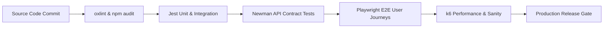
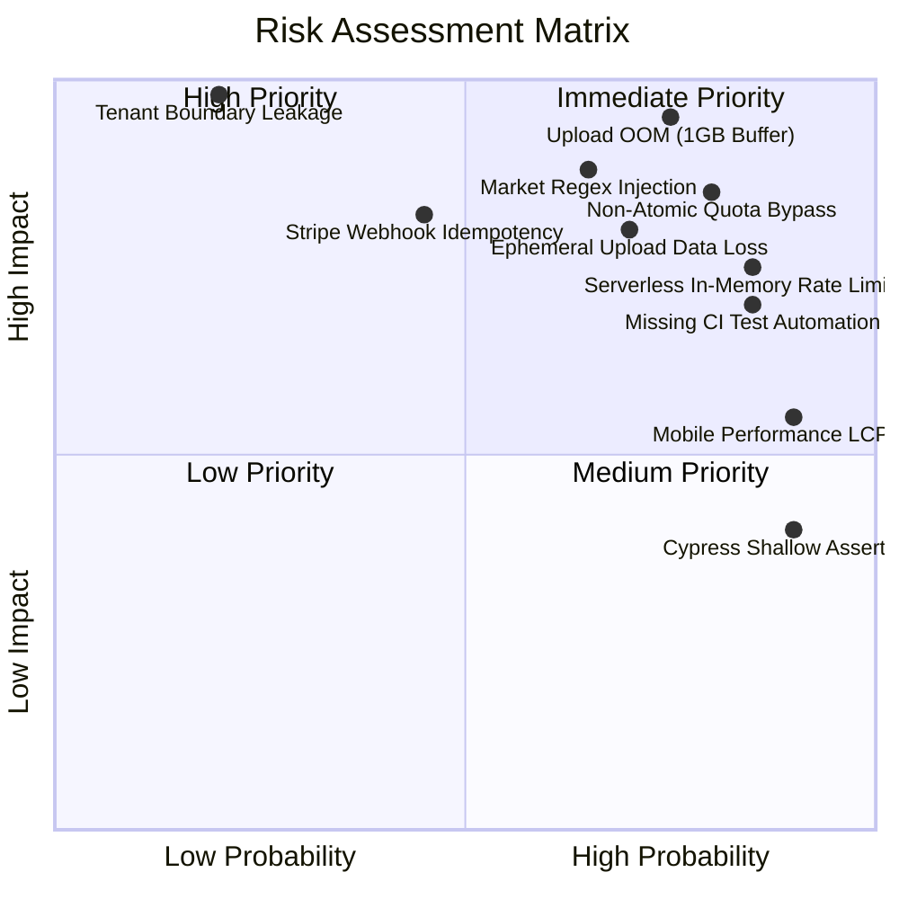
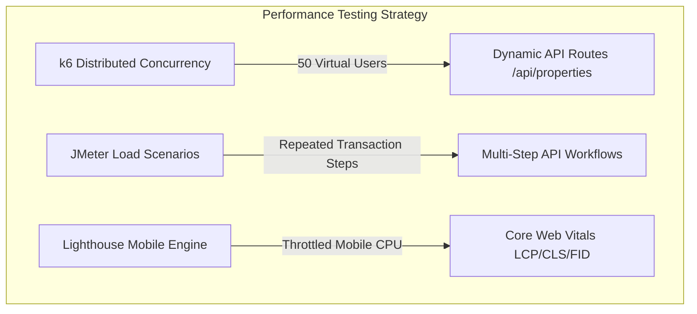
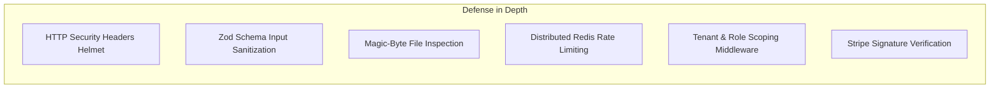
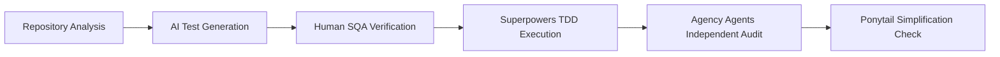
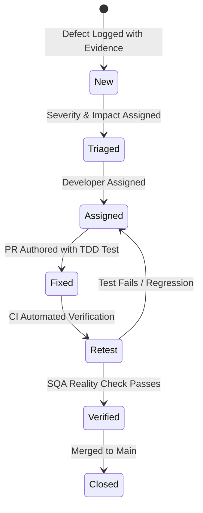

# QA Strategy

**Project:** Real Estate Lead Scoring & Multi-Tenant Agency Portal (`real-estate-lead-scoring`)  
**Repository:** `c:\Users\malee\real-estate-lead-scoring`  
**Target Environment:** Production Cloud Infrastructure (Vercel Serverless / MongoDB Atlas / Cloudinary / Stripe)  
**Document Version:** 1.0.0  
**Effective Date:** September 17, 2026  
**Primary Review References:** [ENGINEERING_REVIEW.md](file:///c:/Users/malee/real-estate-lead-scoring/ENGINEERING_REVIEW.md) | [AI_TEST_GENERATION.md](file:///c:/Users/malee/real-estate-lead-scoring/AI_TEST_GENERATION.md)

---

## 1. Objectives

The primary objective of this Software Quality Assurance (SQA) Strategy is to establish an evidence-based, automated, and repeatable quality engineering framework for the `real-estate-lead-scoring` platform.

The target quality goals for a production release candidate include:
1. **Multi-Tenant Boundary Isolation:** Guarantee 100% strict data partitioning across all 18 agency-scoped database collections, eliminating cross-tenant leakage.
2. **Deterministic Role-Based Access Control (RBAC):** Prevent horizontal and vertical privilege escalation across `super_admin`, `agency_admin`, `agent`, and `customer` roles.
3. **Data Integrity & Concurrency Safety:** Ensure atomic subscription limit enforcement, race-condition immunity, and reliable billing event handling.
4. **Memory Safety & Resource Resilience:** Mitigate Denial-of-Service (DoS) and Out-Of-Memory (OOM) risks during multipart media uploads and high-concurrency traffic bursts.
5. **Deterministic AI Reasoning:** Validate tool execution grounding, prompt parameter confirmation gates, and hallucination prevention.
6. **Performance & Core Web Vitals Targets:** Maintain sub-200ms API response times (p95) under normal load and achieve mobile Lighthouse Performance >= 80 (LCP <= 2.5s).
7. **Accessibility & Usability:** Maintain WCAG 2.1 AA compliance across all public marketplace and agency portal views.
8. **Automated Continuous Integration Gates:** Ensure zero breaking changes merge to `main` without automated linting, unit, integration, API contract, and E2E regression verification.

---

## 2. Scope

```mermaid
graph TD
    subgraph Frontend Tier
        FE1[React 19 / Vite SPA]
        FE2[Framer Motion & Animations]
        FE3[Tailwind CSS v4 & Recharts]
        FE4[Core Web Vitals & Accessibility]
    end

    subgraph Backend & API Tier
        BE1[Express 4 REST Routers / 24 Modules]
        BE2[Zod Input Validation Schemas]
        BE3[JWT Lifecycle & Auth Middleware]
        BE4[Multi-Tenant Resolver & Gating]
    end

    subgraph Business & AI Engines
        BIZ1[Billing & Stripe Webhook Engine]
        BIZ2[Deterministic AI & LLM Tools]
        BIZ3[Multipart Uploads & Cloudinary]
        BIZ4[Market Price Trends & Valuation]
    end

    subgraph Data & Infra Tier
        DB1[MongoDB 7 / Mongoose 8 Data Layer]
        DB2[Multi-Document Transaction Cascades]
        DB3[Rate Limiters & Session Stores]
        DB4[GitHub Actions CI/CD Pipeline]
    end

    Frontend Tier --> Backend & API Tier
    Backend & API Tier --> Business & AI Engines
    Business & AI Engines --> Data & Infra Tier
```

The QA strategy encompasses the following functional and technical layers:

- **Frontend:** Single-page application built on React 19 (`^19.2.7`), Vite 8 (`^8.1.1`), React Router DOM 7 (`^7.18.1`), and Tailwind CSS v4 (`^4.3.2`); UI component state lifecycles, form validation, client-side caching, Framer Motion animations, responsive viewports, and Core Web Vitals.
- **Backend / API:** 24 Express 4 (`^4.19.2`) routers with 150+ endpoints; HTTP request routing, Zod payload validation, parameter sanitization, error middleware, and HTTP status code correctness.
- **Authentication & RBAC:** User registration, bcrypt password hashing, JWT generation/verification, refresh token rotation, and strict role hierarchy enforcement (`super_admin`, `agency_admin`, `agent`, `customer`).
- **Multi-Tenancy:** Dynamic tenant resolution via subdomain, `?workspace=` query parameter, and `x-tenant-id` headers; tenant scoping across 18 Mongoose models; physical separation of un-scoped super-admin platform routes.
- **AI Assistant & Reasoning Engine:** Hybrid rule-based NLP engine and LLM function calling; tool argument schemas, prompt grounding against database records, and destructive action confirmation gates.
- **Billing & Subscriptions:** Tier enforcement (`free_trial`, `starter`, `pro`, `enterprise`), listing/agent quota tracking, Stripe checkout session management, and idempotent webhook processing.
- **File Uploads:** Multer multipart processing, image/video size constraints, client MIME vs magic-byte verification, and Cloudinary / S3 / Local storage provider adapters.
- **Database & Data Layer:** MongoDB 7 / Mongoose 8 (`^8.5.0`) schema definitions, indexes, aggregation pipelines (market trends, dashboard metrics, recommendation ranking), and multi-document transactions.
- **Performance & Load:** Endpoint latency profiles under concurrency, rate-limiting behavior, memory heap allocation during large file transfers, and frontend bundle size optimization.
- **Security:** OWASP API Top 10 mitigation, HTTP baseline security headers (Helmet), injection prevention (NoSQL & RegExp), public file route access controls, and third-party dependency vulnerabilities.
- **Accessibility:** WCAG 2.1 AA conformance, keyboard tab-order navigation, ARIA live regions for toasts and notifications, form label associations, and color contrast.
- **CI/CD Pipeline:** GitHub Actions workflow automation, automated unit/integration execution, API contract testing, E2E browser automation, and dependency security scanning.

---

## 3. Test Pyramid

The testing strategy adopts a calibrated pyramid model to balance rapid developer feedback, comprehensive regression coverage, and cost-effective execution:

```
                  /\
                 /  \
                / E2E\               5%  - Playwright End-to-End User Journeys
               /------\
              / Perf & \             5%  - k6 Concurrency & JMeter Scenarios
             / Security \            5%  - npm audit, Helmet checks, OWASP scans
            /------------\
           / API Contract \         10%  - Newman / Postman Collection Tests
          /----------------\
         / Integration Tests\       35%  - Jest + Supertest (Routes, Services, DB)
        /--------------------\
       /   Unit / Component   \     40%  - Jest (Schemas, AI, Utils, Formatters)
      /------------------------\
```

### Layer Ratios and Purpose

| Layer | Target Ratio | Primary Objective | Execution Speed | Primary Tools |
| :--- | :---: | :--- | :--- | :--- |
| **Unit Tests** | 40% | Verify isolated pure functions, Zod schemas, AI parsing rules, currency formatters, and utility logic without network or DB I/O. | Instant (<5s) | Jest (`server/package.json`) |
| **Integration Tests** | 35% | Validate Express routes, Mongoose schema hooks, tenant scoping, RBAC middleware, and multi-model database transactions against live MongoDB. | Fast (15–30s) | Jest, Supertest, MongoDB 7 |
| **API Contract Tests** | 10% | Validate request/response JSON contracts, query parameters, status codes, and schema compliance across all public and protected endpoints. | Fast (<10s) | Newman, Postman Collection |
| **Security & Dependencies** | 5% | Detect known CVEs in npm dependency trees, verify baseline HTTP security headers, and test injection defenses. | Fast (<15s) | npm audit, Supertest security assertions |
| **Performance & Load** | 5% | Measure API p95 latency under concurrency, identify memory leaks during file uploads, and verify rate limiter thresholds. | Moderate (1–3m) | k6, Apache JMeter |
| **End-to-End (E2E)** | 5% | Validate critical browser workflows (signup -> subscription -> listing creation -> AI inquiry -> lead scoring) across modern browser engines. | Slower (1–2m) | Playwright |

---

## 4. Test Types & Approach



### 4.1 Unit Testing
- **Objective:** Verify individual units of logic in isolation (schemas, NLP intent classifiers, currency formatters, utility functions).
- **Tool:** Jest (`server/package.json`).
- **Scope:** `server/src/features/ai/localEngine/`, `server/src/features/*/*.schema.js`, utility modules.
- **Entry Criteria:** Clean syntax, no linter errors.
- **Exit Criteria:** 100% pass rate on unit assertions; statement coverage >= 85% on pure utility modules.
- **Automation Strategy:** Run on every file save in local watch mode and on every PR via GitHub Actions CI.

### 4.2 Integration Testing
- **Objective:** Validate end-to-end HTTP request/response flows through Express middleware, controllers, services, and MongoDB database interactions.
- **Tool:** Jest + Supertest (`server/tests/integration/*.test.js`).
- **Scope:** 43 backend test suites covering Authentication, Property Management, Multi-Tenancy Isolation, AI Reasoning, RBAC Status Codes, Billing Webhooks, and Platform Administration.
- **Entry Criteria:** Active MongoDB test database instance (standalone with replica set or MongoDB container service).
- **Exit Criteria:** Zero failures across all integration suites; clean database teardown after each suite.
- **Automation Strategy:** Executed automatically in CI against a dedicated MongoDB 7 container service.

### 4.3 API Contract Testing
- **Objective:** Ensure all API endpoints adhere to strict request/response contracts, valid HTTP status codes, and error payload standards.
- **Tool:** Newman (`newman run ./real-estate-api.postman_collection.json`).
- **Scope:** Public search, property estimation, authenticated user profiles, listing CRUD, agency registrations, and lead scoring.
- **Entry Criteria:** Running backend API server seeded with standardized test fixtures.
- **Exit Criteria:** 100% assertions green; zero permissive `.oneOf([200, 401, 403])` assertions; expand coverage beyond the current 5 endpoints to cover all 24 routers.
- **Automation Strategy:** CLI command `npm run test:api` executed against local/staging test servers and in CI post-build step.

### 4.4 End-to-End (E2E) Browser Testing
- **Objective:** Validate complete multi-step user journeys across Chromium, Firefox, and WebKit, testing UI rendering, state management, and API integration.
- **Tool:** Playwright (`e2e/*.spec.js`) as primary tool; Cypress (`cypress/e2e/`) maintained for smoke checks.
- **Scope:** User authentication, agency dashboard navigation, property filtering, lead CRM status changes, and responsive layout checks.
- **Entry Criteria:** Frontend Vite preview server and backend API operational with seeded test data.
- **Exit Criteria:** All 14 Playwright specs passing without flaky retries or unhandled console errors.
- **Automation Strategy:** Run via `npm run test:e2e` in CI on all PRs targeting `main`.

### 4.5 Performance & Concurrency Testing
- **Objective:** Measure response latency, error rates, and system throughput under concurrent load; verify rate limiter behavior.
- **Tool:** k6 (`performance/k6-load-test.js`) for distributed API concurrency; Apache JMeter (`performance/real-estate-load-test.jmx`) for repeatable protocol-level load tests.
- **Scope:** High-volume read routes (`GET /api/properties`), compute-heavy routes (`GET /api/properties/estimate-price`), and dashboard aggregations (`GET /api/properties/analytics`).
- **Entry Criteria:** Dedicated staging or local performance environment.
- **Exit Criteria Target:** p95 latency < 300ms at 50 virtual users; zero HTTP 500 errors; rate limits gracefully returning HTTP 429 with `Retry-After` headers.
- **Automation Strategy:** Scheduled nightly runs and pre-release performance validation scripts.

### 4.6 Security & Supply Chain Auditing
- **Objective:** Identify vulnerabilities in runtime dependencies, verify baseline HTTP defense headers, and prevent injection vectors.
- **Tool:** `npm audit`, `oxlint`, Supertest security assertions (`server/tests/integration/security.test.js`).
- **Scope:** Server and client `package.json` dependencies; Helmet headers; regex input validation; static upload directory permissions.
- **Entry Criteria:** Installed `node_modules` and lockfiles.
- **Exit Criteria:** 0 High or Critical CVEs; Helmet middleware verified; all regex inputs escaped.
- **Automation Strategy:** Run `npm audit --audit-level=high` in CI pipeline as a mandatory blocking gate.

### 4.7 Accessibility & Core Web Vitals Auditing
- **Objective:** Evaluate UI compliance with WCAG 2.1 AA standards and Google Core Web Vitals thresholds.
- **Tool:** Google Lighthouse CLI (`performance/lighthouse-report.html`).
- **Scope:** Public homepage, listings marketplace, agency detail views, property compare pages, and authentication screens.
- **Entry Criteria:** Production build served via `npm run preview`.
- **Exit Criteria Target:** Accessibility score = 100; Best Practices = 100; SEO >= 80; Performance >= 80 (LCP <= 2.5s, CLS <= 0.1).
- **Automation Strategy:** Automated Lighthouse CI runs on staging deployments.

### 4.8 Code Quality & Static Analysis
- **Objective:** Detect syntax errors, unreachable code, unhandled async promises, and React hook anti-patterns.
- **Tool:** oxlint (`npx oxlint`).
- **Scope:** 222 server files and 155 client files.
- **Entry Criteria:** Raw JavaScript / JSX codebase.
- **Exit Criteria:** 0 lint errors, 0 warnings across application business logic.
- **Automation Strategy:** Run via `npm run lint` in pre-commit hooks and CI.

### 4.9 Architectural & Simplification Audits
- **Objective:** Eliminate redundant helpers, remove dead abstractions, verify tenant isolation boundaries, and maintain lean dependencies.
- **Tool:** Superpowers TDD workflows, Agency Agents independent review protocols, and Ponytail simplification audits.
- **Scope:** Monorepo architecture, middleware chains, test fixtures, duplicate currency formatters, and interface files.
- **Entry Criteria:** Active feature branch or completed milestone.
- **Exit Criteria:** All findings triaged, verified against repository code, and logged in `ENGINEERING_REVIEW.md`.
- **Automation Strategy:** Executed during architectural review checkpoints before major release merges.

---

## 5. Existing Automated Test Evidence

The following table summarizes the verified test results and provides an objective reality-check contrasting passing status with actual test depth:

| Evidence Source | Executed Scope | Verified Result | SQA Reality Check & Coverage Assessment |
| :--- | :--- | :--- | :--- |
| **Backend Jest Suite** | 43 test suites, 637 tests (`server/tests/`) | **42 Passed, 1 Failed** (636/637 tests green) | **High Quality Core:** Comprehensive integration coverage across auth, RBAC, AI, properties, and billing. The single failing suite (`agencyDeletion.test.js`) is an environmental constraint: local standalone MongoDB lacks replica-set multi-document transaction support. |
| **Jest AI Reasoning Layer** | 10 assertions (`aiReasoningLayer.test.js`) | **10/10 Passed** (6.04s execution) | **Strict Grounding:** Verifies prompt grounding, confirmation gates for destructive updates, and tool call schema validation. |
| **Newman API Suite** | 15 requests, 24 assertions (`real-estate-api.postman_collection.json`) | **24/24 Passed** (100% pass rate) | **Narrow Scope & Permissive Assertions:** Tests only 5 endpoints out of 150+ across 24 routers (~10% coverage). Several assertions use permissive `.oneOf([200, 401, 403])` status checks, masking potential authorization flaws. |
| **Playwright E2E Suite** | 3 spec files, 14 tests (`e2e/*.spec.js`) | **14/14 Passed** (Chromium) | **Solid Functional E2E:** Deeper assertions testing navigation, form submissions, login failure handling, and listing search filtering. |
| **Cypress E2E Suite** | 30 tests (`cypress/e2e/real-estate-ui.cy.js`) | **30/30 Passed** | **Shallow Smoke Coverage:** 28 of 30 tests check only `cy.get("body").should("be.visible")` or route path changes. Non-existent IDs pass because the error layout renders a body tag. |
| **JMeter Load Benchmark** | 500 requests, 50 threads (`real-estate-load-test.jmx`) | **500 Passed, 0 Errors** (15.2 req/s) | **Misleading Metric:** Benchmark exclusively targeted `GET /api/health`—a static zero-I/O route placed before rate limiting. Does not measure database query or business logic capacity. |
| **k6 Concurrency Test** | 50 Virtual Users (`k6-load-test.js`) | **HTTP 429 Throttling Triggered** | **Rate Limiter Confirmation:** Correctly demonstrated that global in-memory `apiLimiter` (300 req/15m) throttles concurrent traffic on `/api/properties`. |
| **Lighthouse Audit** | Mobile audit (`performance/lighthouse-report.html`) | **Perf 40, A11y 100, BP 100, SEO 82** | **Frontend Optimization Needed:** Outstanding accessibility and security posture, but mobile performance (40) is degraded by heavy Framer Motion bundles and unoptimized LCP (5.7s). |
| **oxlint Static Linter** | 222 server files, 155 client files | **0 Errors, 4 Server Warnings** | **High Code Cleanliness:** Server warnings restricted to non-breaking fast-path returns; client warnings predominantly in third-party vendor charting components. |

> [!IMPORTANT]
> **Passing Execution vs. Adequate Coverage:** A 100% pass rate in Newman (24/24) or Cypress (30/30) must not be confused with comprehensive test coverage. Newman exercises only ~10% of API routes, and Cypress performs shallow visibility checks. Production readiness requires expanding test breadth and assertion depth.

---

## 6. Risk-Based Testing

Testing resources and test cases must be prioritized strictly according to production risk impact and failure likelihood:



### Risk Area Details & Justifications

1. **Upload Security & Resource Exhaustion (Critical Risk):**
   - *Why High Risk:* `upload.middleware.js` buffers up to 1000 MB (5 x 200MB videos) in Node.js process heap memory. On serverless containers with 1024 MB limits, a single concurrent multipart request causes an immediate process crash (OOM). Client-declared MIME types also permit executable uploads without magic-byte verification.
2. **Subscription Quota Enforcement (High Risk):**
   - *Why High Risk:* `billingService.assertWithinLimit` performs a non-atomic `countDocuments` check followed by a separate creation call. Under concurrent requests, agencies can bypass plan quotas (TOCTOU race condition), creating financial and operational leakage.
3. **API Input Validation & Regex Injection (High Risk):**
   - *Why High Risk:* `GET /api/market/city/:city` dynamically constructs `new RegExp` from raw parameters without Zod validation, causing unhandled 500 crashes on invalid regex strings and exposing the server to ReDoS attacks.
4. **Authentication & Credential Rate Limiting (High Risk):**
   - *Why High Risk:* Auth limiters (`loginLimiter`, `signupLimiter`) rely on in-memory counters. In horizontal or serverless environments, counters reset on cold starts, permitting brute-force attacks across distributed lambdas.
5. **Production Storage Durability (High Risk):**
   - *Why High Risk:* If production is misconfigured to use `localProvider.js`, uploads stored in ephemeral local directories are permanently destroyed upon container recycling.
6. **Multi-Tenant Isolation (High Impact Risk):**
   - *Why High Risk:* Cross-tenant data leakage in property listings, inquiries, customer CRM logs, or financial analytics destroys customer trust and violates privacy compliance.
7. **AI Tool Confirmation & Grounding Gates (High Impact Risk):**
   - *Why High Risk:* AI reasoning engines must not execute destructive mutations (e.g., updating listing price, deleting inquiries, reassigning leads) without explicit human confirmation parameters.
8. **Stripe Webhook Replay & Idempotency (Medium Risk):**
   - *Why High Risk:* Stripe retries webhooks on transient network timeouts. Without an `event.id` deduplication ledger, duplicate payments or subscription activations could trigger redundant side effects.
9. **Rate Limiter Concurrency Bottlenecks (Medium Risk):**
   - *Why High Risk:* A rigid global 300 req/15m limit across all `/api/*` endpoints throttles legitimate public marketplace traffic under normal browsing load.
10. **Data Integrity During Cascading Deletions (Medium Risk):**
    - *Why High Risk:* Agency deletion involves cascading deletes across 18 collections. Without transactional guarantees (replica set session), partial failures can leave orphaned records.

---

## 7. Test Data Strategy

```
+---------------------------------------------------------------------------------------+
|                               TEST DATA ARCHITECTURE                                  |
+---------------------------------------------------------------------------------------+
|  TENANT A (slug: "metro-properties")         TENANT B (slug: "apex-realty")           |
|  - Agency Admin: admin@metro.test            - Agency Admin: admin@apex.test          |
|  - Agent: agent1@metro.test                  - Agent: agent2@apex.test                |
|  - Listings: 15 Residential, 5 Commercial    - Listings: 8 Commercial, 2 Plots        |
|  - Plan: "pro" (max 50 listings)             - Plan: "starter" (max 10 listings)      |
+---------------------------------------------------------------------------------------+
|  GLOBAL / PLATFORM TENANT (Un-scoped)                                                 |
|  - Super Admin: superadmin@platform.test                                              |
|  - Platform Audits, Global Agency Approvals, System Metrics                           |
+---------------------------------------------------------------------------------------+
|  PUBLIC / ANONYMOUS USERS                                                             |
|  - Customer: customer@buyer.test (Inquiries, Saved Searches, Reviews)                 |
+---------------------------------------------------------------------------------------+
```

### 7.1 Role-Based Persona Accounts

| Role | Test Username / Identifier | Tenant Affiliation | Intended Test Operations |
| :--- | :--- | :--- | :--- |
| **`super_admin`** | `superadmin@realestate.test` | None (Global) | Agency approval/rejection, global metrics, tenant purge, system config. |
| **`agency_admin`** | `admin-metro@agency.test` | `metro-properties` | Agent onboarding, agency profile updates, listing CRUD, billing checkout. |
| **`agency_admin`** | `admin-apex@agency.test` | `apex-realty` | Competing tenant; used for cross-tenant isolation and boundary tests. |
| **`agent`** | `agent-sarah@agency.test` | `metro-properties` | Assigned lead management, CRM status updates, property creation. |
| **`customer`** | `buyer-john@consumer.test` | None / Public | Public search, price estimation, inquiry submission, property reviews. |

### 7.2 Synthetic Domain Entities
- **Properties:** Seed datasets representing diverse property categories (`house`, `apartment`, `commercial`, `plot`), locations (`Islamabad`, `Lahore`, `Karachi`), price ranges (PKR 50 Lakh to 50 Crore), and media configurations (subdocuments + flat arrays).
- **Inquiries & Leads:** Multi-stage CRM leads (`new`, `contacted`, `qualified`, `closed`) with variable AI lead scores (0–100) and priority flags.
- **Subscription Tiers:** Mock Stripe subscriptions configured with tier limits (`free_trial`: 5 properties; `starter`: 10 properties; `pro`: 50 properties; `enterprise`: unlimited).
- **AI Conversations:** Seeded conversation histories with explicit context flags (`pending_confirmation: true`, `target_property_id`).

### 7.3 Security & Boundary Payloads
- **Malicious & Edge Payloads:** Non-hex ObjectIds (`compare?ids=invalid,123`), regex syntax (`/city/[unclosed`), negative pagination limits (`?limit=-10`), XSS strings in inquiry messages (`<script>alert(1)</script>`), and extreme values (`price: 999999999999999`).
- **File Upload Payloads:** Valid JPEG (100KB), valid PNG (500KB), oversized image (15MB), valid PDF (2MB), valid MP4 (50MB), oversized video (250MB), spoofed executable (`shell.php` with `image/jpeg` header), and corrupted image buffers.

### 7.4 Data Isolation & Secret Governance
- **Zero Hardcoded Secrets:** All test API keys, Stripe webhook secrets, and JWT secrets MUST be injected via environment variables (`TEST_JWT_SECRET`, `STRIPE_TEST_SECRET_KEY`).
- **Database Teardown:** Every test suite executes `beforeAll` seeding and `afterAll` / `afterEach` teardown hooks using distinct test database names (`realestate_test_${worker_id}`).

---

## 8. Environment Strategy

```mermaid
flowchart TD
    subgraph Local Dev
        L1[Developer Machine]
        L2[Vite Dev Server :5173]
        L3[Node Express :5000]
        L4[MongoDB Standalone / ReplSet]
    end

    subgraph CI Environment
        C1[GitHub Actions Runner]
        C2[MongoDB 7 Container Service]
        C3[Headless Playwright & Newman]
        C4[npm audit & oxlint]
    end

    subgraph Staging Environment
        S1[Vercel Preview Deployments]
        S2[MongoDB Atlas Dev Cluster]
        S3[Cloudinary Media Test Folder]
        S4[Stripe Test Mode Webhooks]
    end

    subgraph Production Environment
        P1[Vercel Production Edge]
        P2[MongoDB Atlas M10+ ReplSet]
        P3[Cloudinary Live Production]
        P4[Stripe Live Mode]
    end

    Local Dev -->|Git Push| CI Environment
    CI Environment -->|Merge to main| Staging Environment
    Staging Environment -->|Promotion Gate| Production Environment
```

### Environment Configuration & Test Allocation

| Environment | Infrastructure Components | Active Test Types | Database Configuration | Storage Provider |
| :--- | :--- | :--- | :--- | :--- |
| **Local** | Node.js v20, Vite 8, Local Express server, Local MongoDB | Unit tests, Integration tests, Playwright local runs, Linter | `mongodb://127.0.0.1:27017/realestate_test` (Single-node replica set recommended for transactions) | Local disk (`server/uploads/`) or Cloudinary Sandbox |
| **CI (GitHub Actions)** | Ubuntu-latest runner, Node.js 20, Mongo 7 service container | Linter (`oxlint`), Jest Unit & Integration with coverage | `mongodb://127.0.0.1:27017/realestate_test` (Docker container with health checks) | Mock memory / Mock Cloudinary |
| **Staging** | Vercel Preview, Node.js runtime, MongoDB Atlas test cluster | Full Newman API regression, Playwright E2E, k6 Concurrency, Lighthouse audit | MongoDB Atlas Multi-Tenant Test Cluster (Replica Set enabled) | Cloudinary (staging folder) |
| **Production** | Vercel Edge/Serverless, MongoDB Atlas M10+ Replica Set, CDN | Health checks, Synthetic uptime monitoring, Smoke checks | MongoDB Atlas Multi-Tenant Production Cluster (3-node replica set) | Cloudinary / AWS S3 Production |

---

## 9. CI/CD Quality Gates

### 9.1 Current CI/CD Pipeline Gaps

Inspection of `.github/workflows/ci.yml` identified the following current state vs. missing automated controls:
- **Currently Running in CI:**
  - `server` job: `npm run lint` (`oxlint`), `npm run test:coverage` (Jest against MongoDB 7 container service).
  - `client` job: `npm run lint` (`oxlint`), `npm run build` (`vite build`).
- **Gaps to Address:**
  1. **API Contract Gaps:** `npm run test:api` (Newman) is omitted from CI workflows (`CI-02`).
  2. **E2E UI Automation Gaps:** Neither Playwright (`test:e2e`) nor Cypress is executed in CI (`CI-01`).
  3. **Performance Regression Gaps:** No automated k6 baseline latency tests exist in the build pipeline (`CI-03`).
  4. **Dependency Security Gaps:** `npm audit` is not enforced as a blocking PR check (`CI-04`).
  5. **Coverage Enforcement Gaps:** `test:coverage` generates LCOV reports but `server/jest.config.js` does not declare `coverageThreshold` (`CI-05`).

### 9.2 Recommended Pull Request (PR) Quality Gates

Every PR targeting `main` must automatically satisfy the following sequential gates:

```
[PR Trigger]
     |
     v
+-------------------------------------------------------------+
| GATE 1: Static Analysis & Security                          |
| - oxlint (Server & Client): 0 errors, 0 critical warnings   |
| - npm audit --audit-level=high (Server & Client): 0 CVEs    |
+-------------------------------------------------------------+
     | (Pass)
     v
+-------------------------------------------------------------+
| GATE 2: Backend Unit & Integration Tests                    |
| - Jest Suite: 43/43 suites green (100% pass)                |
| - Jest Coverage Threshold: Lines >= 80%, Branches >= 75%   |
+-------------------------------------------------------------+
     | (Pass)
     v
+-------------------------------------------------------------+
| GATE 3: API Contract Verification                           |
| - Newman Collection Suite: All endpoints pass strict schema |
+-------------------------------------------------------------+
     | (Pass)
     v
+-------------------------------------------------------------+
| GATE 4: Frontend Build & E2E Verification                   |
| - Vite Production Build: Exit code 0                        |
| - Playwright E2E Suite: 14/14 specs green (Headless Chrome) |
+-------------------------------------------------------------+
     | (Pass)
     v
[Merge Approved]
```

---

## 10. Performance Strategy



### 10.1 Load & Concurrency Architecture

- **JMeter Scope Clarification:** As documented in `PERF-02`, the existing JMeter test (`performance/real-estate-load-test.jmx`) targets only `/api/health`, measuring static HTTP return speed (15.2 req/s) with zero database load. JMeter must be expanded to test dynamic multi-step workflows (Search -> Filter -> View Property -> Submit Inquiry).
- **k6 Concurrency Testing:** k6 (`performance/k6-load-test.js`) is the designated tool for realistic API concurrency. It exercises heavy endpoints (`/api/properties`, `/api/properties/estimate-price`, `/api/properties/analytics`) with ramped Virtual Users (10 -> 25 -> 50 VUs). In execution, this exposed the in-memory 300 req/15m limit (`PERF-01`).
- **Rate Limiting Calibration:** Move rate limiter storage from process memory to Redis/Upstash (`AUTH-02`, `PERF-01`). Decouple public search reads from mutation rate limits to eliminate false-positive HTTP 429 throttling on legitimate browsing traffic.

### 10.2 Database & Aggregation Performance

- **Recommendation Sorting (`DB-01`):** Replace in-memory array sorting with MongoDB aggregation pipelines using `$abs` and `$subtract` with an index on `{ city: 1, type: 1, status: 1 }`.
- **Analytics Query Consolidation (`DB-02`):** Consolidate 8 parallel database queries in `getAnalytics()` into a single `$facet` aggregation with a 5-minute cache layer.

### 10.3 Frontend Core Web Vitals

- **Measured Baseline:** Lighthouse mobile audit (`performance/lighthouse-report.html`): Performance score: **40** (LCP: 5.7s, FCP: 3.7s, Speed Index: 4.2s).
- **Proposed Acceptance Targets:**
  - **Largest Contentful Paint (LCP):** <= 2.5 seconds.
  - **First Contentful Paint (FCP):** <= 1.8 seconds.
  - **Cumulative Layout Shift (CLS):** <= 0.1.
  - **Interaction to Next Paint (INP):** <= 200 milliseconds.
  - **Lighthouse Performance Score:** >= 80.
- **Remediation Plan:** Implement dynamic route-based chunking with `React.lazy()`, compress hero images using WebP/AVIF, disable desktop cursor-tracking canvases on mobile viewports (`FE-02`), and resolve synchronous React effect state cascades (`FE-01`).

---

## 11. Security Strategy



### 11.1 OWASP API Security Controls

| OWASP Risk Category | Current Status & Implemented Controls | Required Hardening & SQA Recommendations | Relevant Findings |
| :--- | :--- | :--- | :--- |
| **API1: Broken Object Level Auth** | Queries scoped by `tenantRepository` wrappers. Super admin routes physically segregated. | Expand tenant boundary tests to cover remaining edge routes. | `TENANT-01`, `TENANT-02` |
| **API2: Broken Authentication** | JWT tokens validated on protected routes; bcrypt password hashing. | Move in-memory rate limiting to Redis to prevent serverless bypass. | `AUTH-01`, `AUTH-02` |
| **API3: Broken Object Property Level Auth** | Zod schemas validate body inputs on core entity routes. | Add Zod query schemas to inquiry list, audit, and search log endpoints. | `API-03`, `API-05` |
| **API4: Unrestricted Resource Consumption** | Memory rate limiting in place (300 req/15m). | Replace 1GB memory buffer with 50MB limits; use Redis-backed rate limiting. | `UPLOAD-01`, `PERF-01` |
| **API5: Broken Function Level Auth** | Role-gating middleware (`requireRole('super_admin')`, etc.) enforced on controllers. | Maintain 100% test coverage in `rbacStatusCodes.test.js`. | `rbacStatusCodes.test.js` |
| **API6: Server-Side Request Forgery** | External image URLs validated against allowed domains. | Maintain allowlist checks for webhook callbacks. | `billingWebhook.test.js` |
| **API7: Security Misconfiguration** | Basic CORS configured in `server/src/app.js`. | Mount Helmet for HTTP security headers; disable `x-powered-by`; restrict public `/uploads`. | `SEC-01`, `SEC-02`, `SEC-04` |
| **API8: Automated Threat Protection** | Endpoint rate limiting active. | Strengthen signup/login limits; add distributed store for serverless instances. | `AUTH-02` |
| **API9: Improper Inventory Management** | 24 API routers registered in `app.js`. | Expand Postman/Newman collection to cover all 24 routers (currently 5). | `API-01` |
| **API10: Unsafe Consumption of APIs** | Stripe webhook HMAC signatures verified; AI tool schemas validated with Zod. | Add Stripe processed event deduplication ledger for idempotency. | `BILLING-02`, `ai.tools.js` |

### 11.2 File Upload Hardening Strategy
- **Magic-Byte Signature Inspection (`SEC-03`):** Add `file-type` to inspect `file.buffer` headers before storage dispatch, replacing reliance on client-supplied `file.mimetype` headers.
- **Storage Isolation (`SEC-04`):** Store sensitive agency identity verification documents (CNIC proofs, NTN certificates) in private, authenticated cloud storage buckets with time-limited signed URLs, removing public `/uploads` static file exposure.

---

## 12. Accessibility Strategy

```
+-----------------------------------------------------------------------------+
|                      ACCESSIBILITY VERIFICATION MATRIX                      |
+-----------------------------------------------------------------------------+
| Measured Baseline (Lighthouse): 100 / 100                                   |
| Target Compliance: WCAG 2.1 Level AA                                        |
+-----------------------------------------------------------------------------+
| Automated Checks (Lighthouse / axe-core):                                   |
| - Color contrast ratios >= 4.5:1 for normal text, >= 3:1 for large text.   |
| - Valid aria-* attributes and role semantics.                               |
| - Explicit alt text on all property imagery and agency logos.               |
|                                                                             |
| Manual & Dynamic Regression Checks (Required):                              |
| - Keyboard Navigation: Tab-order through multi-step agency registration.     |
| - Focus Trapping: Modals (AI Assistant, Filter Drawer) trap and return focus|
| - Screen Reader Announcements: Toast notifications (react-hot-toast).       |
| - Form Error Association: aria-describedby linked to validation errors.     |
+-----------------------------------------------------------------------------+
```

> [!NOTE]
> **Why Lighthouse 100 is Not the Finish Line:** While the current automated Lighthouse audit reports a perfect 100 in Accessibility, automated scanners catch only ~30–40% of WCAG compliance issues. Ongoing manual and automated regression tests are required for dynamic interactive states (e.g., keyboard traps in the AI floating modal, focus management on multi-step wizard navigation, and ARIA live announcements during asynchronous lead updates).

---

## 13. AI-Assisted Testing Strategy

As documented in [AI_TEST_GENERATION.md](file:///c:/Users/malee/real-estate-lead-scoring/AI_TEST_GENERATION.md), AI tooling is integrated as an **engineering accelerator** to enhance test generation and defect discovery, governed by strict human-in-the-loop validation rules:



### AI Testing Governance Rules

1. **AI-Generated Test Candidates:** AI tools may propose boundary test cases, edge-case property payloads, and mock conversation scenarios based on repository schemas.
2. **Repository-Aware Test Generation:** All AI-generated tests must import active repository modules, schemas, and fixtures. Hallucinated APIs or non-existent endpoints are strictly rejected.
3. **Human SQA Verification:** Every AI-generated test suite must be reviewed by a human QA engineer for technical correctness, assertion validity, and absence of tautological tests (`expect(true).toBe(true)`).
4. **Superpowers TDD Workflow:** Follow the established test-driven development workflow: write failing integration tests reproducing defects before authoring fixes; verify green test runs.
5. **Wire-Level Testing Over Fragile Mocks:** For AI reasoning tests, employ real local in-process HTTP wire servers (`fakeLlmServer.js`) to exercise true wire protocol parsing.
6. **Agency Agents Independent Review:** Maintain separate analytical roles ("API Tester" and "Reality Checker") to independently audit test assertions, uncover coverage gaps, and challenge optimistic claims.
7. **Ponytail Simplification Review:** Continuously evaluate test code to prevent over-engineering, eliminate duplicate helpers, and retire redundant test frameworks without sacrificing coverage.

---

## 14. Defect Management

### 14.1 Severity Classification Matrix

| Severity | Definition | Impact Examples | Target Resolution SLA |
| :--- | :--- | :--- | :--- |
| **Critical** | System outage, total data loss, severe remote code execution, or complete authentication bypass. | Database corruption, global cross-tenant data leak, unauthenticated admin takeover. | **< 4 Hours** (Hotfix blocker) |
| **High** | Major feature broken, memory exhaustion crash risk, plan quota bypass, or exploitable injection vulnerability. | 1GB upload buffering OOM (`UPLOAD-01`), TOCTOU subscription bypass (`BILLING-01`), market regex 500 crash (`API-04`). | **< 24 Hours** (Release blocker) |
| **Medium** | Partial feature impairment, API contract discrepancy, poor mobile performance, or missing automated CI checks. | Permissive Newman status assertions (`API-02`), Lighthouse mobile perf 40 (`PERF-03`), missing E2E in CI (`CI-01`). | **< 3 Sprints** (Sprint priority) |
| **Low** | Minor UI polish, linter warning, procedural code duplication, or environment-specific developer inconvenience. | Currency formatter duplication (`CODE-03`), standalone Mongo transaction failure (`DB-03`), dead interface files (`CODE-02`). | **Backlog / Tech Debt** |

### 14.2 Defect Lifecycle



---

## 15. Entry & Exit Criteria

```
+------------------------------------------------------------------------------------+
|                               PHASE GATING CRITERIA                                |
+------------------------------------------------------------------------------------+
| FEATURE TESTING ENTRY:                                                             |
| [ ] Feature branch rebased on latest main.                                         |
| [ ] Zod validation schema defined for all new endpoints.                           |
| [ ] Zero oxlint linter errors.                                                     |
|                                                                                    |
| FEATURE TESTING EXIT:                                                              |
| [ ] 100% unit and integration tests passing.                                       |
| [ ] Branch coverage >= 75% on new business logic.                                  |
| [ ] PR peer review approved.                                                       |
|------------------------------------------------------------------------------------|
| REGRESSION TESTING ENTRY:                                                          |
| [ ] All feature PRs merged into release candidate branch.                          |
| [ ] Staging environment deployed with latest migrations.                           |
|                                                                                    |
| REGRESSION TESTING EXIT:                                                           |
| [ ] Full Jest integration suite green (43/43 suites).                              |
| [ ] Expanded Newman API collection (60+ endpoints) passes 100%.                     |
| [ ] Playwright E2E suite (14/14 specs) green on staging.                           |
| [ ] 0 High or Critical open defects.                                               |
|------------------------------------------------------------------------------------|
| PRODUCTION RELEASE ENTRY & EXIT:                                                   |
| [ ] All automated CI/CD quality gates green.                                       |
| [ ] Zero High/Critical CVEs in npm audit.                                          |
| [ ] k6 Concurrency: p95 latency < 300ms at 50 VUs with 0 errors.                   |
| [ ] Release readiness checklist 100% signed off.                                   |
+------------------------------------------------------------------------------------+
```

---

## 16. Release Readiness Checklist

Before authorizing any production deployment, the SQA team and Engineering Lead must verify all items:

- [ ] **Functional & Integration Tests:** 43 Jest backend suites passing (637/637 tests green) on MongoDB replica set.
- [ ] **AI Reasoning Verification:** `aiReasoningLayer.test.js` 10/10 assertions passing; prompt grounding and tool schemas verified.
- [ ] **API Contract Verification:** Newman collection executed with strict status assertions across all 24 routers.
- [ ] **End-to-End User Journeys:** Playwright suite (14/14 specs) passing across Chromium, Firefox, and WebKit.
- [ ] **Security Hardening:** `helmet` mounted, `x-powered-by` disabled, upload magic-byte verification active, private documents protected.
- [ ] **Supply Chain Security:** `npm audit` reporting 0 High or Critical CVEs across server and client.
- [ ] **Performance & Load:** k6 load test executed; rate limits configured with distributed Redis store; zero 429 rejections on standard search traffic.
- [ ] **Accessibility & Web Vitals:** Lighthouse Mobile score >= 80; Accessibility = 100; Best Practices = 100.
- [ ] **CI/CD Quality Gates:** GitHub Actions workflow executing lint, test, coverage threshold, Newman, and Playwright on `main`.
- [ ] **Observability & Logging:** Structured JSON request logging, error tracking, and database connection pool monitoring active.
- [ ] **Rollback Readiness:** Database migration down-scripts validated; previous production artifact pinned for instant rollback.

---

## 17. Known Quality Risks (from ENGINEERING_REVIEW.md)

The following priority risks from [ENGINEERING_REVIEW.md](file:///c:/Users/malee/real-estate-lead-scoring/ENGINEERING_REVIEW.md) must be remediated or mitigated prior to general production launch:

1. **`[UPLOAD-01]` Upload Memory Buffering (High):** Multer in-memory buffering (up to 1000MB) presents an acute OOM crash risk on serverless containers.
2. **`[BILLING-01]` Non-Atomic Quota Checks (High):** TOCTOU race condition in `billingService.assertWithinLimit` allows concurrent listing creation past plan limits.
3. **`[API-04]` Market Regex Injection (High):** Raw `new RegExp` compilation in `market.service.js` leads to unhandled 500 crashes and ReDoS exposure.
4. **`[AUTH-02]` & `[PERF-01]` In-Memory Rate Limiting Bottlenecks (High):** In-memory limiter resets per serverless instance and prematurely throttles concurrent read traffic.
5. **`[DEP-01]` Server Dependency CVEs (High):** Unpatched vulnerabilities in Multer (multipart DoS) and Nodemailer.
6. **`[UPLOAD-02]` Ephemeral File Storage (High):** Local storage provider in serverless production causes silent media loss upon container recycling.
7. **`[PERF-03]` Mobile Web Vitals (Medium):** Mobile Lighthouse performance score of 40 with 5.7s LCP.
8. **`[API-01]` & `[API-02]` Newman Contract Gaps (High/Medium):** Only ~10% of API endpoints covered in Postman, using permissive `.oneOf()` status assertions.
9. **`[TEST-01]` Shallow Cypress Assertions (Medium):** Cypress tests perform shallow body visibility checks rather than multi-step workflow verification.
10. **`[CI-01]` & `[CI-02]` CI Workflow Gaps (High):** CI pipeline omits Newman API tests, Playwright E2E tests, and dependency auditing.
11. **`[DB-03]` Standalone MongoDB Transaction Failure (Low):** Developer environments require single-node replica set configuration for `agencyDeletion.test.js`.

---

## 18. Final QA Recommendation

### 18.1 Current Quality Posture Summary

The `real-estate-lead-scoring` codebase exhibits strong domain architecture, sophisticated multi-tenancy partitioning, deterministic AI reasoning with strict tool gating, and high backend test pass rates (636/637 tests passing). The core business logic is well-structured and maintainable.

### 18.2 Remaining Quality Gaps

1. **Upload & Memory Safety:** High-risk heap buffering during multi-file video uploads.
2. **Concurrency & Race Conditions:** Non-atomic subscription limit verification during concurrent property insertions.
3. **API Contract & CI Automation Gaps:** Major portions of the API router surface lack contract tests in CI, and E2E browser tests are excluded from the main CI workflow.
4. **Distributed Rate Limiting:** Auth and API rate limiters lack shared Redis storage required for serverless deployments.
5. **Mobile Frontend Performance:** Heavy JavaScript bundle sizes and unoptimized Largest Contentful Paint (5.7s).

### 18.3 Required Remediation Gates Before Production Release

```
[Release Candidate]
       |
       +---> [Gate A: Security & Memory Fixes]
       |     - Cap upload memory buffer; add magic-byte validation
       |     - Sanitize market regex inputs; mount Helmet security headers
       |     - Fix ObjectId CastError 500s on comparison endpoints
       |
       +---> [Gate B: Concurrency & Rate Limiting]
       |     - Enforce atomic $inc quota checks on Agency model
       |     - Connect Redis store to rateLimiters.js
       |     - Run npm audit fix on server and client
       |
       +---> [Gate C: CI Automation & Test Expansion]
       |     - Add Newman and Playwright jobs to .github/workflows/ci.yml
       |     - Enforce coverageThreshold (80%) in Jest configuration
       |     - Retire redundant Cypress suite; consolidate in Playwright
       |
       v
[Production Deployment Sign-Off]
```

### 18.4 Recommended Future Automation

1. **Continuous Visual Regression Testing:** Integrate Playwright screenshot diffing (`expect(page).toHaveScreenshot()`) into CI to prevent unexpected CSS/layout regressions.
2. **Automated Mutation Testing:** Introduce `Stryker Mutator` on core billing and tenant-scoping modules to measure test assertion effectiveness.
3. **Automated Synthetic Monitoring:** Deploy automated Playwright synthetic probes against staging and production environments to monitor login, search, and inquiry availability 24/7.
